<p align="center">
  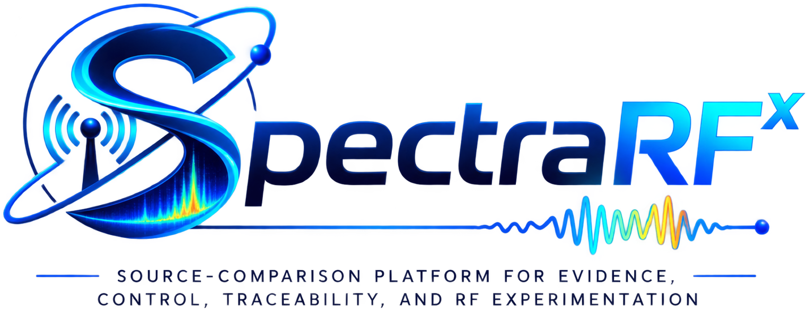
</p>

# SpectraRFˣ

**Source-Comparison Platform for Evidence, Control, Traceability, and RF
Experimentation.**

## What SpectraRFˣ is

SpectraRFˣ is a software-defined-radio research platform for RF
acquisition, spectrum analysis, controlled experimentation, evidence
traceability, and physical-layer source comparison. It combines real SDR
acquisition, spectrum/waterfall/3D visualization, governed I/Q datasets,
BLE radio-frequency fingerprinting workflows, experimental controls, and
traceable scientific evaluation in a single research environment.

The workflow the rest of this document is built around is BLE-RFFI source
comparison. A Bluetooth Low Energy (BLE) address is a *logical* identifier
— a value a device's firmware reports, and one an attacker can copy into a
different transmitter. SpectraRFˣ asks a different, physical-layer
question: **does this radio emission actually match a specific, previously
enrolled transmitter?**

It answers that question using **RF fingerprinting (RFFI)** — comparing the
raw radio waveform of a new emission against reference recordings from known
transmitters, rather than trusting the logical address alone. The raw
waveform is captured as **I/Q samples** (in-phase/quadrature — the complex
baseband representation that preserves the actual analog signal, not just
its decoded bits) using a real **USRP B200** software-defined radio (SDR).

SpectraRFˣ is a research platform, not a finished product claim: every
capability below is labeled by what is actually implemented, what real
experimental evidence backs it, and what remains open. That distinction is
never inferred just from a UI control existing.
### SpectraRFˣ in action

<p align="center">
  
</p>

<p align="center"><em>RF Terrain 3D — live WFM spectrum moving through time and frequency.</em></p>

<p align="center">
  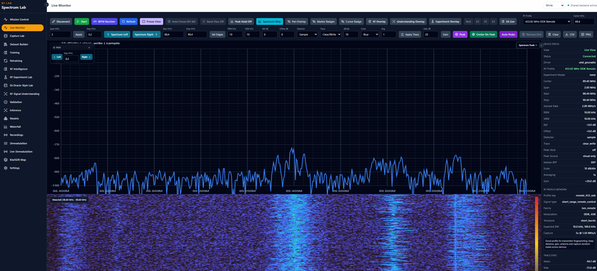
</p>

<p align="center"><em>Live Monitor.</em></p>

<p align="center">
  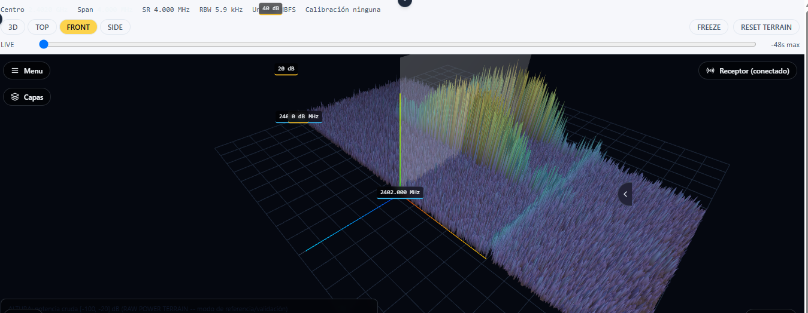
</p>

<p align="center"><em>RF Terrain 3D.</em></p>

<p align="center">
  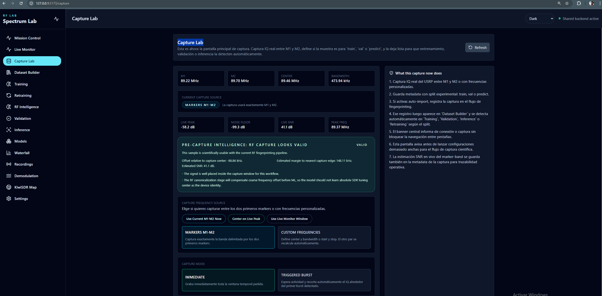
</p>

<p align="center"><em>Capture Lab.</em></p>

<p align="center">
  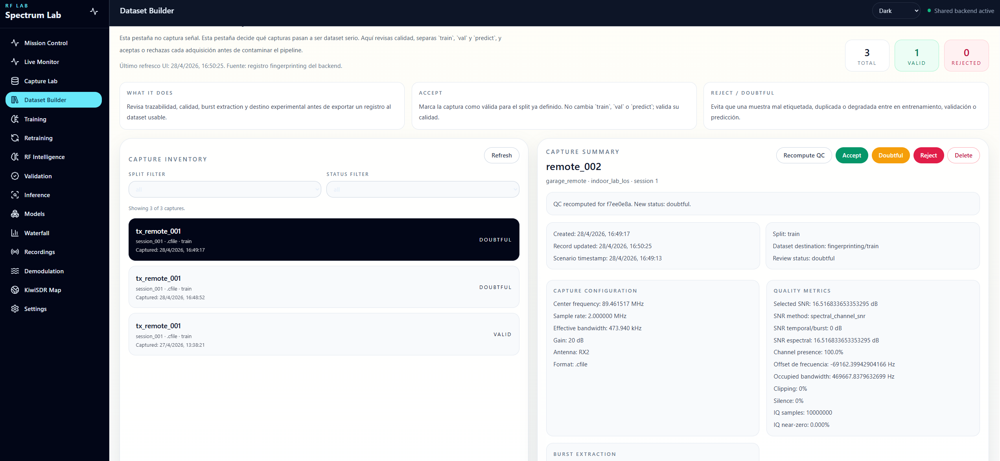
</p>

<p align="center"><em>Dataset Builder.</em></p>

Real-time spectrum observation, a 3D spectral-terrain view, controlled I/Q
capture, and dataset governance — more views (Waterfall, RF Intelligence
overlay, Spectrum Tools, Live Demodulation): see [Platform modules and
UI](#platform-modules-and-ui).
---

This README is organized into **two scopes that should not be conflated**:

| Scope | Purpose | How to read it |
|---|---|---|
| **Part I — BLE-RFFI scientific study** | The controlled technical/scientific workflow behind the current BLE radio-frequency-fingerprinting study: acquisition, evidence admission, dataset construction, RQ1-RQ4 controls, real results, limitations, and pending confirmatory work | Treat this as the paper-facing scientific record |
| **Part II — Broader SpectraRFˣ platform** | General RF tools that let a scientist or engineer inspect, visualize, capture, demodulate, characterize, and continue investigating signals beyond the BLE-RFFI question | Treat these modules as complementary research capabilities unless a Part I experiment explicitly uses them |

The separation is deliberate: a capability can be real and useful in the
platform without being part of the scientific contribution above, and a
visible UI feature is never treated by itself as scientific evidence.

**Navigate:** [Part I — BLE-RFFI scientific study](#part-i-ble-rffi-scientific-study) · [Scientific results](#current-experimental-results) · [Scientific limitations](#scientific-limitations) · [Part II — broader platform](#part-ii-broader-platform) · [Platform modules](#platform-modules-and-ui) · [Quick start](#quick-start)

---

<a id="part-i-ble-rffi-scientific-study"></a>
## Part I — BLE-RFFI scientific study

### Scientific scope of the paper

The paper-facing part of SpectraRFˣ investigates a narrow physical-layer
source-comparison problem: **given a later BLE RF emission, how compatible
is it with a fixed set of previously enrolled physical transmitters when
the decision is made from retained radio evidence rather than from the
advertised logical address alone?**

The scientific scope includes:

- real USRP B200 I/Q acquisition for the BLE-RFFI dataset;
- burst detection, BLE packet recovery, CRC checking, evidence admission, and traceability;
- capture/session-disjoint TRAIN, VALIDATION, and held-out same-campaign TEST partitions;
- the four implemented RQ2 signal representations and their disclosed model-selection procedures;
- RQ1 acquisition-dependence measurement;
- the executed exploratory RQ4 analytical-region and feature-group controls;
- scientific uncertainty, per-class/session diagnostics, decision-window checks, evidence lineage, limitations, and pending experiments;
- a strict distinction between already-executed DEVELOPMENT evidence and the still-pending protected future confirmatory campaign.

The following are **not automatically paper contributions or paper
validation evidence**: the general Live Monitor, RF Terrain 3D, RF
Intelligence, general Capture Lab workflows, analog/digital demodulation,
KiwiSDR exploration, and other open RF tools. They are described in Part
II because they broaden what a scientist or engineer can investigate with
the platform.

### Scientific objectives

| Objective | What is measured or controlled |
|---|---|
| Acquisition dependence | Whether discrimination changes when evaluation moves away from acquisition conditions shared with training |
| Representation dependence | How engineered RF descriptors, raw I/Q, STFT, and coarse morphology behave on the same admitted evidence under the disclosed selection procedure |
| Radio-state intervention | Whether a controlled transmitter reset differs from a continuous-control path; implemented but still pending real RQ3 acquisition |
| Packet/analytical-content dependence | Whether performance changes when the analytical region available to the model is restricted |
| Descriptor-group dependence | How the PRIMARY engineered-feature result changes when declared feature groups are removed or isolated in exploratory VALIDATION-only controls |
| Population and class structure | Whether aggregate behavior hides per-unit, per-session, or enrolled-population effects |

The current experiments do not fully isolate persistent physical identity
from receiver, channel, session or environmental effects — see [Scientific
limitations](#scientific-limitations).

### Scientific contribution boundary

RF fingerprinting, raw-I/Q neural models, time-frequency models,
engineered-feature classifiers, and sensitivity to acquisition conditions
are established prior art — SpectraRFˣ does not present any one of them as
a standalone novelty. The paper-facing contribution is the **controlled
integration and traceable evaluation** of these techniques in one real BLE
source-comparison pipeline over genuine USRP B200 acquisitions, with
acquisition dependence, representation dependence, analytical-region/
descriptor-group controls, and confirmatory-state separation all treated
as explicit, measured, or clearly pending — never asserted independently
of the evidence below. Full positioning and the exact terms this project
avoids as unqualified claims: [Scientific problem](#scientific-problem) and
[`docs/research/CONTRIBUTION.md`](docs/research/CONTRIBUTION.md).

---

### At a glance

The BLE-RFFI workflow this platform is built around, end to end:

```text
RF emission
   |
   v
USRP B200 captures I/Q (the raw radio waveform)
   |
   v
BLE bursts are detected and packets recovered (CRC-checked)
   |
   v
evidence is admitted and traced (which transmitter, under what basis)
   |
   v
dataset is partitioned (TRAIN / VALIDATION / TEST, no leakage)
   |
   v
models are trained and evaluated
   |
   v
a later, questioned emission is compared against the enrolled transmitters
```

SpectraRFˣ uses **two independent SDR acquisition paths, each serving a
different purpose** — mixing them up produces wrong claims about what the
platform actually measured, so the distinction matters from the first read:

| | General SDR / spectrum workspace | BLE-RFFI source-comparison workflow |
|---|---|---|
| Purpose | Interactive spectrum/waterfall viewing, rule-based RF-object detection, demodulation | The governed pipeline above: real BLE-RFFI evidence, datasets, models, and results |
| SDR access | GNU Radio's `uhd.usrp_source` | SoapySDR Python bindings, `driver="uhd"` |
| Where it lives | Live Monitor, RF Intelligence, Demodulation | BLE-RFFI Studio, BLE Scientific Results Studio |

Full engineering detail on how these two paths are kept separate: see
[Experimental architecture](#experimental-architecture).

### Key terms

A short glossary, so the results below can be read without already knowing
this project's vocabulary. Each term is used consistently in every section
that follows.

- **RFFI** — radio-frequency fingerprinting: comparing the physical radio
  waveform of a transmitter against reference recordings, as a
  complement to (never a replacement for) protocol-level identity.
- **I/Q** — in-phase/quadrature complex baseband samples: the preserved raw
  waveform, not a decoded/summarized version of it.
- **closed-set** — the comparison is always against a fixed, known,
  enrolled set of transmitters (four, in the current study) — not an
  open-ended search over arbitrary unknown devices.
- **admission** — the process, and its documented basis, by which a
  captured example is allowed into the dataset with a class label. Full
  detail: [Dataset and provenance](#dataset-and-provenance).
- **DEVELOPMENT** — evidence from real, current, non-confirmatory
  experimentation. It is real and on real hardware, but it is not the
  one-time, protected confirmatory evaluation described next.
- **TRAIN / VALIDATION** — the two partitions used to fit and select
  models. Neither is used for the confirmatory decision.
- **held-out same-campaign TEST** — a real, already-executed,
  capture-disjoint evaluation partition, held out from training and model
  selection, but drawn from the *same acquisition campaign* as
  TRAIN/VALIDATION.
- **future confirmatory campaign** — a separate, still-**pending**
  evaluation, to be acquired only after the analysis is frozen under a
  versioned protocol. This is *not* the same thing as the TEST partition
  above — full distinction: [Held-out TEST vs. the future confirmatory
  campaign](#held-out-test-vs-the-future-confirmatory-campaign).
- **PRIMARY** — refers to the `engineered_rf` Random-Forest pipeline,
  selected on VALIDATION data as the main branch for the closed-set
  analysis. Every later "PRIMARY" mention refers to this same, specific,
  frozen model.
- **STRONG / AMBIGUOUS** — outcomes of the *auxiliary* native-BLE/SDR
  timing-and-address association check (not the dataset admission
  mechanism): `STRONG` means a unique, corroborated match; `AMBIGUOUS`
  means more than one candidate matched and neither was preferred. Full
  detail: [Native BLE and B200 association](#native-ble-and-b200-association).
- **AdvA** — the BLE advertiser address field inside a packet: logical,
  copyable information, not physical proof of the transmitter.
- **pre-PDU** — an analytical view restricted to only the BLE preamble and
  access address, ending before the PDU header — so AdvA and the payload
  are simply unavailable to the model in that view.
- **`receiver_epoch`** — a qualified-state identity boundary for the
  receiver, used to decide whether two recordings were taken under a
  continuous, unchanged receiver state.

**RQ1–RQ4, the four scientific controls used throughout this document:**

- **RQ1** — does performance survive independent acquisition?
- **RQ2** — how does signal representation affect discrimination?
- **RQ3** — what changes after a controlled radio-state intervention?
- **RQ4** — how much does packet/analytical content affect discrimination?

Full explanation of each: [Scientific controls: RQ1 to RQ4](#scientific-controls-rq1-to-rq4).

#### Physical unit pseudonyms used in figures

The four enrolled transmitters are named in prose and tables by their real
identifiers (`CC2541SensorTag`, `CC2650-UNIT-01`, `keyfobdemo 01`,
`keyfobdemo 02`), but some generated figures label them with short
pseudonyms instead, to keep axis labels compact:

| Pseudonym | Real identifier |
|---|---|
| TX-01 | `CC2541SensorTag` |
| TX-03 | `keyfobdemo 01` |
| TX-04 | `keyfobdemo 02` |
| TX-05 | `CC2650-UNIT-01` |

This mapping is a display-only convention for figure generation — it is not
a field in any canonical dataset or registry artifact.

### Scientific problem

We have a limited set of physical BLE devices, previously **enrolled** —
recorded and characterized ahead of time under controlled conditions. Later,
a new RF emission appears. The practical question this project investigates
is:

**Which enrolled physical device is most compatible with this RF emission?**

**Context.** Known physical BLE devices can be recorded beforehand, under
controlled conditions.

**Problem.** A BLE advertising address is *logical* information — a value
the device's firmware reports. It is not, by itself, physical proof of
which radio actually generated the waveform: an attacker only needs to copy
that value into a different transmitter.

**Approach.** The USRP B200 preserves the actual RF waveform as raw I/Q
samples. Controlled reference examples are built from known, enrolled
devices; models are trained on those references; a later, questioned
emission is compared against the frozen enrolled set — never decided from
the advertised address alone.

Two different moments use the RF evidence differently, and the distinction
matters for the whole rest of this document.

**Enrollment** — building the reference:

```text
known device -> Windows/native BLE (independent logical observation)
             -> B200 captures real RF I/Q
             -> association / admission
             -> reference example
```

**Questioned-source comparison** — using the reference later:

```text
new RF emission -> B200
                 -> frozen preprocessing / frozen model
                 -> comparison against enrolled devices
                 -> result, or inconclusive
```

Windows/native BLE helps **build and check** the enrolled references during
enrollment. It is **not** supplied to the RF classifier as the answer during
later source comparison (full detail on exactly how bounded its role is:
[Native BLE and B200 association](#native-ble-and-b200-association)). If the
native Windows stack had to identify every future emission in advance, the
RF-fingerprint classifier would add little value on top of it — the entire
point of BLE-RFFI Studio is a comparison method that works from radio
evidence alone, once enrollment is done.

RF fingerprinting itself is established prior art, as are raw-I/Q CNN
fingerprinting, STFT/CNN2D fingerprinting, classical engineered-feature
classifiers, BLE-specific RF fingerprinting, and channel/power-cycle
sensitivity studies of RF fingerprints. SpectraRFˣ does not claim novelty
for any of those individual techniques. The more defensible contribution is
the **controlled integration**, in one real BLE source-comparison pipeline
over genuine USRP B200 acquisitions, of explicit acquisition-dependence
measurement (RQ1), a protocol that separates TRAIN -> VALIDATION ->
model/threshold selection -> held-out same-campaign TEST (already executed,
see [Held-out TEST vs. the future confirmatory
campaign](#held-out-test-vs-the-future-confirmatory-campaign) and [RQ1
results](#rq1-results)) from a separate, still-pending protected future
confirmatory campaign released only after an analytical freeze (see [Held-out
TEST vs. the future confirmatory
campaign](#held-out-test-vs-the-future-confirmatory-campaign) and [Pending
experimental work](#pending-experimental-work)), radio-state intervention
(RQ3), BLE packet-content controls (RQ4), and end-to-end evidence lineage —
together, with real code and real tests, rather than any one of them treated
as a solved side detail. Terms this project deliberately avoids as
unqualified claims: *first*, *receiver-invariant*, *channel-invariant*,
*validated forensic attribution*, *validated real-time identification*. Full
positioning: [`docs/research/CONTRIBUTION.md`](docs/research/CONTRIBUTION.md).

---

### Experimental architecture

SpectraRFˣ uses two independent SDR acquisition paths, each serving a
different purpose, as introduced in [At a glance](#at-a-glance). Keeping
them explicit matters because they use different SDR APIs and produce
different artifacts:

| | BLE-RFFI capture path (produces the dataset below) | General spectrum-tools path (Live Monitor, RF Intelligence, demodulation) |
|---|---|---|
| SDR API | SoapySDR Python bindings, direct | GNU Radio's `uhd.usrp_source` block, direct |
| Device selection | `SoapySDR.Device({"driver":"uhd","serial":...})` | `gnuradio.uhd`, driver reported by the API as `uhd_gnuradio` |
| Entry point | `backend/tools/ble_sdr_capture_worker.py` | `backend/tools/spectrum_stream_worker.py` and siblings |
| Orchestration | `BleCaptureJobManager` -> `BleIqCaptureService` (subprocess, RadioConda Python) | `real_spectrum_stream.py` (persistent subprocess) |

```text
UI -> FastAPI -> BleCaptureJobManager -> BleIqCaptureService
   -> ble_sdr_capture_worker.py -> SoapySDR -> driver="uhd" -> USRP B200
```

Real, campaign-persisted facts about this chain: UHD version `UHD
4.8.0.0-release` (observed, persisted per real capture); B200 serial
`E3R04Z1B2`; device identity confirmed via `device.getHardwareKey() ==
"B200"`. Full chain, per-layer evidence, and the reproducibility table:
[`docs/ble/B200_ACQUISITION_CHAIN_TECHNICAL_AUDIT.md`](docs/ble/B200_ACQUISITION_CHAIN_TECHNICAL_AUDIT.md).

<details>
<summary>Engineering detail: cross-process exclusivity, device probing, and SoapySDR version provenance</summary>

The BLE-RFFI capture path acquires a real, cross-process file lock
(`SdrDeviceArbiter`) before opening the B200. The general spectrum-tools path
does **not** check that lock — any exclusion between the two paths would come
from the UHD driver refusing a second open on the same busy USB device, not
from this codebase.

SoapySDR's own library/API/ABI version is **not** persisted for any
completed capture (computed only during device *probing*, never written into
a capture manifest — and on Windows the probe path itself is usually
bypassed by a `pnputil`-based enumeration shortcut).

</details>

**Conventional BLE adapter (used alongside the B200, enrollment only).** A
Windows-default Bluetooth adapter — manufacturer/model/chipset/VID-PID are
**not documented** anywhere in the codebase, only "the OS-default adapter"
is ever queried. Stack: Bleak `0.22.3` on the WinRT backend. Its exact,
strictly bounded role (never an I/Q source, never a label source) is
detailed once, in full, in [Native BLE and B200
association](#native-ble-and-b200-association) — not repeated elsewhere in
this document. Full audit:
[`docs/ble/BLE_ADAPTER_TECHNICAL_AUDIT.md`](docs/ble/BLE_ADAPTER_TECHNICAL_AUDIT.md).

---

### BLE-RFFI acquisition and evidence path

```text
1. Capture RF I/Q (USRP B200, frozen acquisition profile)
2. Detect candidate bursts
3. Recover BLE packets and verify CRC
4. Associate packet evidence with an enrolled physical device (fail-closed policy, see Native BLE and B200 association)
5. Create traceable examples tied to their exact source I/Q and sample range
6. Build capture-disjoint scientific partitions (TRAIN / VALIDATION / held-out same-campaign TEST)
7. Train -> validate -> freeze -> held-out same-campaign TEST -> (later) protected future confirmatory campaign
```

> **CRC-valid packet ≠ physical-source identity.** A correctly decoded
> packet proves the bits were received correctly. It does not, by itself,
> prove which enrolled physical device sent them — that is exactly what
> steps 4 and 7 exist to establish, separately and explicitly, never
> assumed from decode success alone.

#### Scientific preprocessing

**`base-v1`** (identity — no signal-altering step) is the preprocessing
profile actually used to produce every real result in this document. Two
other registered profiles exist in code but did **not** produce these
results:

- **`paper-eq6-7-v1`** — implemented but not used for the current results: a
  frozen BLE reference waveform `q[n]`, phase unwrapping over a frozen
  fitting interval (`preamble + access address`), a joint least-squares
  estimate of an affine phase/frequency offset, with per-burst provenance
  when it runs. A real, useful future ablation, not part of current
  evidence.
- **`offset-retaining-v1`** — the sensitivity-analysis counterpart to
  `paper-eq6-7-v1`. Because the real PRIMARY run already uses identity
  preprocessing, `offset-retaining-v1` resolves to the exact same (identity)
  configuration as `base-v1` for every real run to date — the two are
  behaviorally indistinguishable at the signal-processing level, so any
  equality between their reported balanced accuracies is a trivial
  consequence of that equivalence, not evidence that affine phase
  compensation leaves the result unchanged.

An older, simpler heuristic (`cfo-compensated-v1`) also exists for
historical/ablation utility, explicitly labeled **heuristic/legacy**. Full
derivation: [`docs/ble/PREPROCESSING.md`](docs/ble/PREPROCESSING.md).

The `cfo_estimate_hz` engineered feature (one of ten `engineered_rf`
descriptors) is a mean sample-to-sample phase-increment estimate over the
**whole**, unprocessed (`base-v1`) burst — best read as an *apparent mean
phase rate*, not a validated, isolated transmitter-CFO measurement: it can
mix GFSK modulation phase structure, true transmitter offset, and the B200
receiver's own local-oscillator offset. None of the other nine engineered
descriptors (power/amplitude statistics, spectral centroid/bandwidth, PAPR,
kurtosis, skewness) are calibrated estimators of a specific
transmitter-hardware impairment either — they are general statistics that
could in principle be influenced by such impairments, never presented as
isolating one.

#### Full evidence-lineage table

<details>
<summary>Every real stage, input, output, acceptance rule, rejection code, and code reference (15 stages)</summary>

| # | Stage | Input | Output | Real acceptance rule | Real rejection | Code |
|---|---|---|---|---|---|---|
| 1 | Acquisition | Frozen profile | Real `.sigmf-data` + manifest | Full sample count written, hash verified | `CAPTURE_SIZE_MISMATCH`, overflow/discontinuity codes | `ble_sdr_capture_worker.py` |
| 2 | Candidate burst detection | Full `.cf32` file | Candidate segments | `power > max(noise*4, noise+8*MAD, 1e-12)` | No active blocks -> 0 candidates | `detect_bursts()`, `ble_sdr_capture_worker.py:278-308` |
| 3 | Sync/timing recovery | One candidate segment | Selected sampling phase (of 16) | `sync_distance <= max_sync_errors(2)` vs. 40-bit preamble+AA | `timing_not_locked` | `timing_interpolator.py`, `dsp_receiver.py:104-112` |
| 4 | GFSK demod | Time-domain samples | Soft/hard bit stream | Deterministic discriminator | N/A | `dsp_receiver.py:56-59` |
| 5 | Dewhitening | Air bits + channel index | Dewhitened bits | Deterministic LFSR | N/A | `whitening.py:3-15` |
| 6 | PDU reconstruction | Dewhitened header+PDU bits | `BleDecodedPacket` | Preamble ≥7/8, AA Hamming distance 0, valid length | Rejected at whichever gate fails first | `bitstream_decoder.py:27-73` |
| 7 | CRC-24 check | PDU bits + received CRC | `crc_received == crc_computed` | Exact match | CRC mismatch -> packet dropped | `crc.py:3-15` |
| 8 | Native BLE / SDR association (auxiliary) | Decoded packet + native rows within ±250 ms | `association_strength` | See [Native BLE and B200 association](#native-ble-and-b200-association) | See [Native BLE and B200 association](#native-ble-and-b200-association) | `_associate()`, `ble_offline_replay.py:923-1047` |
| 9 | Evidence Stage resolution | Decoded packet address + Physical Device Registry | `physical_unit_id` + `LabelDecision` | Registry binding, or operator-declared physical isolation | `QUARANTINED` on a declared-off contradiction | `evidence_stage.py:90-160` |
| 10 | Dataset freeze | Selected `ExampleRecord`s | Frozen `DatasetManifest` | Deterministic composition hash, quality gate `ACCEPTED_FOR_TRAINING` | `NOT_ACCEPTED_FOR_TRAINING` | `dataset/dataset_builder.py` |
| 11 | Split | Frozen dataset | TRAIN/VALIDATION/TEST | No leakage on capture/execution/session/candidate/packet/sample-range | `NOT_FEASIBLE` | `split_builder.py` |
| 12 | Training | Split + `model_type` | `TrainingRun` + weights | Converges without exception | `FAILED` | `training_service.py` |
| 13 | VALIDATION scoring/selection | All trained candidates | One recommended model | `0.5*macro_f1 + 0.3*balanced_accuracy_proxy - unknown_capability_penalty` | N/A | `model_selector.py:37-68` |
| 14 | Held-out same-campaign TEST evaluation | Recommended (always) + opt-in others | `evaluation_report.json` | Honest provenance recorded | N/A | `evaluator.py` |
| 15 | Export/approval | Trained model + all required files | `ModelBundleManifest` | All 16 `REQUIRED_BUNDLE_FILES` present and hashed | `REJECTED` / `TEST_NOT_EXECUTED` | `contracts/bundle.py:26` |

Linking IDs that let any model score be traced back to raw IQ: `iq_sha256`
(capture) -> `candidate_id` -> `packet_id`/`packet_sha256` -> `example_id`
-> `dataset_manifest_sha256` -> `split_manifest_sha256` -> `training_run_id`
-> `bundle_id`. Full mechanism, every ID, every real count:
[`docs/ble/SCIENTIFIC_STATUS.md`](docs/ble/SCIENTIFIC_STATUS.md).

</details>

#### Native BLE and B200 association

Auxiliary corroboration only, never a label source. A conventional Windows
Bluetooth adapter runs alongside the B200 during enrollment, purely as an
auxiliary logical observation, with a strictly bounded role:

- It never supplies I/Q — the B200 is the only RF evidence source used for
  training/evaluation.
- Its RSSI is diagnostic only, never one of the ten engineered RFFI
  features.
- Its host-side timestamps are generated at Python-callback time, not at RF
  reception time.
- **There is no RF-level or hardware-clock synchronization with the B200**
  — no PPS, no GPS, no shared trigger. The only link is host-clock proximity
  plus a **±250 ms candidate-search tolerance window**, used purely to
  narrow which native BLE observation *might* correspond to a decoded SDR
  packet. This is a candidate-matching parameter, not a timing-
  synchronization bound.

**Calibration attempt, real and current.** The full threshold grid
`50-500 ms` was swept for a STRONG-match criterion (`≥0.95` coverage).
Result: `NO_THRESHOLD_SATISFIES_CRITERIA` — `0.0` coverage and `0`
false-strong matches at every single threshold in the grid. The real corpus
currently contains **0 STRONG** native/SDR associations across all five
registered units. Among the 9,891 labeled examples in the current corpus,
**28 resolve to `association_status = AMBIGUOUS`** (0.28%); the remainder
splits between `PHYSICAL_ISOLATION_DECLARED` (4,338, 43.9%) and
pre-registered address-binding with no independent match (5,525 `NONE`, plus
the 28 `AMBIGUOUS`, together the 5,553-example address-bound cohort).

**This auxiliary mechanism does not generate the classifier's
training/evaluation labels.** `physical_unit_id` — the field every real
`class_distribution` is built from — is resolved independently by the
Evidence Stage's own registry binding (declared physical isolation, or
pre-registered address binding), never from the STRONG/WEAK/NONE native-
BLE/SDR association value. A dataset can, and in practice does, contain
real, non-`STRONG` examples. Consequently: `CRC-valid packet ≠
physical-source identity`, and `native context ≠ STRONG association`. This
is a real, current negative result, not a criterion that was loosened to
get a pass. Full detail (source association and RQ4 eligibility sections):
[`docs/ble/SCIENTIFIC_STATUS.md`](docs/ble/SCIENTIFIC_STATUS.md).

---

### Dataset and provenance

Current real four-unit closed-set corpus: `CC2541SensorTag`,
`CC2650-UNIT-01`, `keyfobdemo 01`, `keyfobdemo 02` — V2-admitted,
session-disjoint, leakage check `PASSED`, **9,891 real examples across 79
real B200 captures**, `Shelly-Plug-01` excluded as a class, no background
pooled in as a fifth class.

#### Corpus composition by class

Computed directly from the real split manifest's `assignments`. The
independent experimental unit here is the capture/session, not the
individual example record — every unit×domain cell below has `n_captures ==
n_sessions` (1:1 pairing in this dataset).

| Physical unit | Domain | n_examples | n_captures / sessions |
|---|---|---:|---:|
| CC2541SensorTag | TRAIN | 447 | 5 |
| CC2541SensorTag | VALIDATION | 187 | 2 |
| CC2541SensorTag | TEST | 216 | 2 |
| CC2650-UNIT-01 | TRAIN | 522 | 7 |
| CC2650-UNIT-01 | VALIDATION | 166 | 3 |
| CC2650-UNIT-01 | TEST | 225 | 3 |
| keyfobdemo 01 | TRAIN | 1,743 | 14 |
| keyfobdemo 01 | VALIDATION | 1,690 | 5 |
| keyfobdemo 01 | TEST | 1,857 | 5 |
| keyfobdemo 02 | TRAIN | 849 | 8 |
| keyfobdemo 02 | VALIDATION | 160 | 2 |
| keyfobdemo 02 | TEST | 166 | 2 |
| **TOTAL** | **TRAIN** | **3,561** | **34** |
| **TOTAL** | **VALIDATION** | **2,203** | **12** |
| **TOTAL** | **TEST** | **2,464** | **12** |

Full table with n_sessions split out separately, and the same data live from
the platform itself: BLE Scientific Results Studio -> **Supporting Tables**
tab; source: [`docs/ble/SCIENTIFIC_STATUS.md`](docs/ble/SCIENTIFIC_STATUS.md) (corpus-composition section).

#### keyfobdemo 01 vs keyfobdemo 02: same model, unverified equivalence

Three separate layers must not be conflated here: what the experimenter
responsible for the campaign reports, what is persisted in artifacts, and
what has been independently verified from those artifacts. They answer
different questions and none of them contradicts another.

**Experimenter-reported fact.** The campaign lead responsible for enrolling
these two units reports that `keyfobdemo 01` and `keyfobdemo 02` are **two
distinct physical units of the same commercial device model**. This
document treats that as the real, declared ground truth about which
physical hardware was enrolled — captured independently (79 real captures
split across them, zero shared source-I/Q/capture/session/example
intervals) and not contradicted by anything below.

**Public documentary status** — what the persisted Physical Device Registry
records actually contain today
(`backend/.../ble_rffi_studio/registry/physical_units/keyfobdemo 0{1,2}.json`):

| Field | `keyfobdemo 01` | `keyfobdemo 02` | Documented? |
|---|---|---|---|
| `manufacturer` | `TI` | `TI` | Yes |
| `device_family` (operator-declared) | `TI sensortag` | `TI sensortag` | Yes, operator-declared |
| `model` (exact commercial SKU/identifier) | `null` | `null` | **Not documented in any persisted artifact** — the exact commercial model identifier was never entered into the registry |
| `same_model_confirmation` | `NOT_CONFIRMED` | `NOT_CONFIRMED` | Reflects that no independent, documented confirmation procedure for this registry field was ever completed and persisted (`same_model_confirmation_basis: null`) — **not** a finding that the two units are different models. Absence of a persisted artifact-level confirmation is not evidence against the experimenter-reported fact above, and this document does not retroactively mark this field `CONFIRMED` without a documented basis for doing so. |
| `internal_serial` | `null` | `null` | Not documented |

**Internal equivalence — not verified, a separate question from the
commercial-model identity above.** Hardware revision, firmware version,
exact radio/chip revision, internal configuration, and antenna/component
equivalence are not documented or independently checked for either unit.
This is narrower than "same commercial model": two units of the same
commercial model can still carry different firmware/hardware revisions
across manufacturing batches or over time, and this repository currently
has no evidence either way.

**Summary of how this document uses these three layers:** *two distinct
physical units of the same commercial device model* (the experimenter-
reported fact, used as-is) — with the exact commercial model identifier
itself absent from every persisted artifact, and hardware/firmware/
chip-revision/configuration equivalence neither documented nor
independently verified.

#### Label provenance

`association_status` breakdown across the 9,891 admitted labels (source:
`label_provenance_report()`, frozen snapshot at
[`docs/ble/evidence/label_provenance_and_composition_IDENTITY-c52850a953.json`](docs/ble/evidence/label_provenance_and_composition_IDENTITY-c52850a953.json)):

| `association_status` | Count | Fraction |
|---|---:|---:|
| `PHYSICAL_ISOLATION_DECLARED` | 4,338 | 43.86% |
| `NONE` (pre-registered address binding, no independent match) | 5,525 | 55.86% |
| `AMBIGUOUS` | 28 | 0.28% |
| `STRONG` | 0 | 0.0% |

**Development label admission ≠ independently corroborated source
association.** All 9,891 admitted labels are development label admissions
under the controlled-acquisition protocol — sufficient to run the
DEVELOPMENT benchmark below, but not equivalent to `STRONG` native-BLE/SDR
association (see [Native BLE and B200
association](#native-ble-and-b200-association)), for which the real corpus
currently has 0 examples and no accepted calibration threshold.

---

### Scientific controls: RQ1 to RQ4

A classifier can score well on held-out data for reasons that have nothing
to do with recognizing real RF hardware characteristics. These four checks
each test one specific, easy alternative explanation.

#### RQ1 — Acquisition dependence

**Does it still work on a new recording?**

```text
related capture -> independent capture -> protected future period
```

Tests whether apparent performance depended on incidental context shared
between TRAIN and TEST captures, rather than on the device's real RF
characteristics.

#### RQ2 — Signal representation

**If every branch receives exactly the same admitted RF evidence, does how
we represent it change the result?**

```text
same admitted RF -> engineered features | raw I/Q | STFT time-frequency | coarse morphology
```

The same examples, the same partitions, four different representations —
see [Implemented BLE-RFFI benchmark](#implemented-ble-rffi-benchmark) for
the four real branches.

#### RQ3 — Radio-state intervention

**Does turning the transmitter off and back on change the fingerprint more
than simply leaving it running?**

```text
PRE -> RESET -> POST
PRE -> CONTINUOUS/CONTROL -> POST
```

`receiver_epoch` (identity + qualified acquisition profile + session
boundary) protects this pairing: a PRE/POST pair is invalidated whenever the
receiver's qualified state changed between the two captures.

> **Limitation, stated explicitly.** For historical data with no logged
> restart/reconnect event, the session boundary uses a >1 hour acquisition
> gap as a documented proxy — **not** direct physical evidence the B200 was
> actually restarted. Detail (receiver-epoch section):
> [`docs/ble/SCIENTIFIC_STATUS.md`](docs/ble/SCIENTIFIC_STATUS.md).

#### RQ4 — Packet-content dependence

**Is the model learning RF characteristics, or exploiting easy-to-copy BLE
packet content?**

```text
full-burst | ADvA-excluded | pre-PDU
```

The ADvA-excluded region genuinely **removes** the AdvA (advertiser address)
sample range — spliced out, never replaced with a fixed zero block, so no
artificial, trivially learnable pattern is introduced. `pre-PDU` is:

```text
Preamble + Access Address | STOP
```

— stopping before the PDU header, so no packet payload content is present
at all in that variant.

#### Implemented BLE-RFFI benchmark

RQ2's four real, executable signal-analysis branches — the only ones
BLE-RFFI Studio trains:

| Representation | Model(s) |
|---|---|
| Engineered RF descriptors | Logistic Regression / SVM-RBF / Random Forest |
| Raw I/Q | CNN1D |
| Time-frequency (STFT) | CNN2D |
| Coarse time-frequency morphology | Frozen morphological baseline (nearest-centroid, no iterative training) |

No other signal-analysis branch is implemented, exposed, or planned. Ideas
beyond this table are tracked separately, explicitly not mixed with it, in
[`docs/research/TECHNIQUE_ROADMAP.md`](docs/research/TECHNIQUE_ROADMAP.md).

#### Held-out TEST vs. the future confirmatory campaign

```text
TRAIN
  |
  v
VALIDATION
  |
  v
model / threshold selection
  |
  v
held-out same-campaign TEST      <- already executed, results below

--------------------------------------------------
future confirmatory campaign, after analytical freeze   <- NOT_YET_AVAILABLE
--------------------------------------------------
```

The **held-out same-campaign TEST** used throughout [Current experimental
results](#current-experimental-results) is a real, already-executed,
capture-disjoint held-out evaluation drawn from the same acquisition
campaign as TRAIN/VALIDATION. It is a genuinely held-out partition (never
seen during training or model selection) — but it is **not** the separate,
still-pending **future confirmatory campaign** that would run under a
frozen analytical protocol after a confirmatory freeze ceremony. The
frozen-protocol mechanism for that future campaign is real and versioned; no
protocol has been run through it yet (`NOT_YET_AVAILABLE`, see [Pending
experimental work](#pending-experimental-work)). These two are structurally
different contract types (`SplitManifest.TEST` vs. `HoldoutGroup.FUTURE_TEST`)
everywhere in this repository — zero real `FUTURE_TEST` assignments exist on
disk today.

---

### Current experimental results

Real four-unit closed-set DEVELOPMENT benchmark. Protected future evaluation
has not been acquired and the protocol freeze has not started (see [Pending
experimental work](#pending-experimental-work)), so every result below is
DEVELOPMENT evidence, not a definitive/confirmatory outcome. Evaluation unit
for every row is `EXAMPLE_RECORD` (burst-level) unless stated otherwise — a
separate, real 10-second decision-window evaluation exists too (see
[Decision windows and secondary
checks](#decision-windows-and-secondary-checks)), never conflated with this
one.

#### RQ1 results

| Evaluation domain | Balanced accuracy | 95% CI | n (examples / sessions) |
|---|---:|---:|---:|
| Capture-dependent (same capture, intentionally leakage-optimistic diagnostic) | 0.958 | [0.939, 0.975] | 1,790 / 34 |
| Capture-disjoint (VALIDATION) | 0.634 | [0.591, 0.685] | 2,203 / 12 |
| Held-out same-campaign TEST | 0.767 | — (no CI persisted for this domain) | 2,464 / 12 |

`delta_dependence = capture-dependent − capture-disjoint = +0.324`, 95% CI
`[0.269, 0.371]` — a class-stratified, session-clustered bootstrap (cluster
key = `session_id`; stratified by `physical_unit_id`; `n_resamples=2000`,
seed `12345`), the two domains resampled **independently** (no physical
pairing exists between them). A real, on-hardware measurement of exactly the
optimism RQ1 is designed to detect: a single-recording evaluation would have
overstated closed-set discrimination by roughly 32 balanced-accuracy points
relative to genuinely disjoint captures.

<p align="center">
  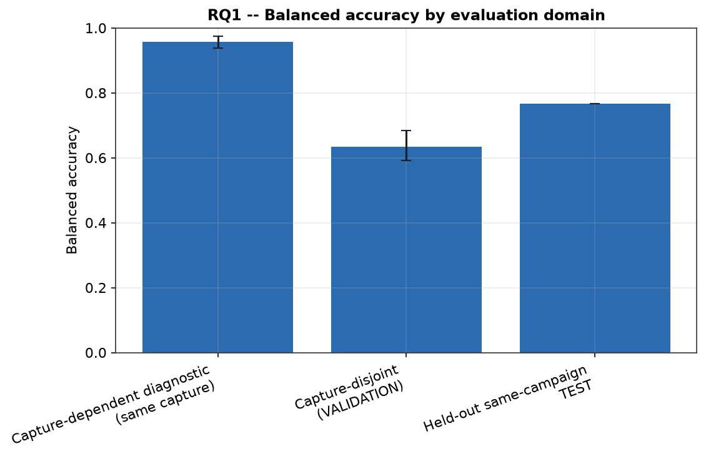
</p>

<p align="center"><em>RQ1 closed-set acquisition dependence.</em></p>

#### RQ2 results

VALIDATION, same admitted groups across all four branches:

| Branch | Balanced accuracy | Macro-F1 |
|---|---:|---:|
| coarse_morphology | 0.277 | 0.128 |
| **engineered_rf (PRIMARY)** | **0.634** | **0.586** |
| raw_iq | 0.248 | 0.226 |
| stft | 0.537 | 0.498 |

`engineered_rf` (best of Logistic Regression / SVM-RBF / Random Forest,
selected on VALIDATION only) was selected PRIMARY here and independently in
all 4 per-unit auxiliary runs — a repeated finding. **Model-selection budget
is not equal across branches**: `engineered_rf` evaluated 3 candidate model
families on VALIDATION and kept the best; the other three branches each used
exactly 1 fixed configuration; none ran a hyperparameter search within its
own family. This is a comparison under a disclosed, unequal selection
procedure, not an equal-budget benchmark.

<p align="center">
  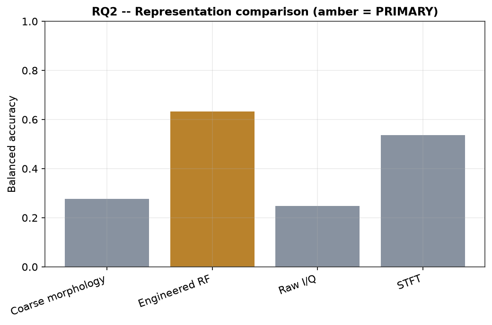
</p>

<p align="center"><em>RQ2 closed-set branch comparison.</em></p>

#### RQ4 results: analytical-region control

A narrower, already-executed control, distinct from the RQ4 packet-condition
intervention (see [Pending experimental work](#pending-experimental-work),
not executed): restricting which samples of the **same, already-acquired**
VALIDATION burst are available to the model, without changing what the
transmitter sent. `pre-PDU` keeps only the preamble (8 bits) + access
address (32 bits), ending strictly before the PDU header. `full-burst`
reuses the existing PRIMARY model and its already-persisted predictions (no
recomputation); `pre-PDU` is an **independent TRAIN-only re-fit** (fresh
`TrainOnlyScaler`, same frozen Random Forest configuration, no
hyperparameter search) evaluated only on pre-PDU VALIDATION. **TEST was not
opened for either arm** (`approval_status=TEST_NOT_EXECUTED`). Both arms
score the identical 2,203 VALIDATION `example_id`s, same order, same 12
sessions, same 4 classes. Marked `DEVELOPMENT_EXPLORATORY`: defined and run
after the RQ1/RQ2 results above had already been inspected (post-hoc, not
pre-registered).

| Region | BA | 95% CI | Macro-F1 | Accuracy | n (examples / sessions) |
|---|---:|---:|---:|---:|---:|
| full-burst | 0.634 | [0.591, 0.685] | 0.586 | 0.749 | 2,203 / 12 |
| pre-PDU | 0.556 | [0.503, 0.628] | 0.495 | 0.647 | 2,203 / 12 |

`delta BA (full-burst − pre-PDU) = 0.078`, 95% CI `[0.046, 0.100]` — a
genuinely matched, class-stratified, session-clustered bootstrap; no
confirmatory significance test is reported for this exploratory contrast.

<p align="center">
  
</p>

<p align="center"><em>RQ4 exploratory full-burst vs pre-PDU.</em></p>

Substantial closed-set discrimination remains under pre-PDU (well above the
four-class chance level of 0.25). **This does not isolate transmitter-
hardware effects** — propagation, receiver state, received power, and other
acquisition dependencies remain present in pre-PDU and are not separated
from any transmitter-specific contribution. The 0.634 -> 0.556 decrease is
itself the result: evidence that closed-set performance depends in part on
the analytical region available to the model, not an estimate of what
fraction of discrimination is attributable to packet content.

Figures below use the [TX pseudonym mapping](#physical-unit-pseudonyms-used-in-figures) (TX-01/03/04/05) introduced in Key terms.

| Unit | Recall, full-burst | Recall, pre-PDU | Δ |
|---|---:|---:|---:|
| CC2541SensorTag | 0.781 | 0.679 | +0.102 |
| CC2650-UNIT-01 | 0.952 | 0.855 | +0.096 |
| keyfobdemo 01 | 0.796 | 0.683 | +0.113 |
| keyfobdemo 02 | 0.006 | 0.006 | +0.000 |

`keyfobdemo 02` recall is **0.006 (1/160) under both regions, unchanged**.
Under full-burst, 159/160 (99.4%) are misassigned to `keyfobdemo 01`, 0 to
either sensor-platform unit. Under pre-PDU, 157/160 (98.1%) go to
`keyfobdemo 01` and 2/160 (1.3%) to `CC2650-UNIT-01` — recall itself does
not change, where the misclassified examples land does.

<p align="center">
  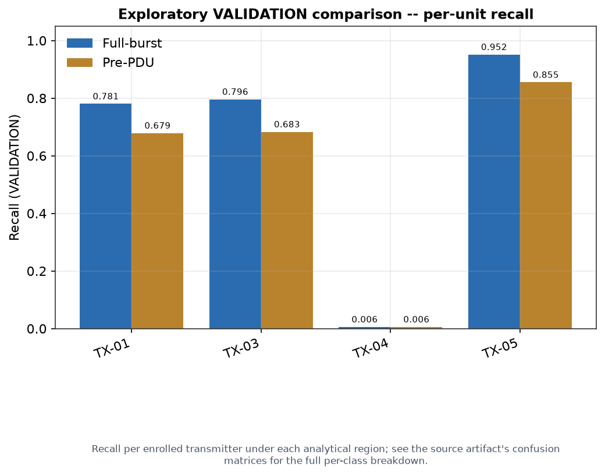
</p>

<p align="center"><em>RQ4 exploratory per-unit recall.</em></p>

Full provenance: `06_statistics/rq4_full_burst_vs_pre_pdu_exploratory_report.json`;
consolidated detail: [full-burst vs. pre-PDU consolidation in `docs/ble/TECHNICAL_EVIDENCE_AUDIT.md`](docs/ble/TECHNICAL_EVIDENCE_AUDIT.md#7-full_burst-vs-pre_pdu--full-consolidation).

#### Feature-group ablation results

A post-hoc, VALIDATION-only exploratory analysis over the same closed-set
corpus and the same frozen Random Forest configuration as PRIMARY,
examining how much of the model's performance comes from the four
power/amplitude-level engineered descriptors versus the remaining six.
**Not** a model-improvement or model-selection exercise: no tuning, no new
TRAIN/VALIDATION population, **TEST remained closed for both new fits**
(`approval_status=TEST_NOT_EXECUTED`), and neither new fit substitutes for
or changes the PRIMARY result — all 29 real files behind PRIMARY's training
run and bundle were SHA-256-hashed before and after this ablation and are
byte-identical. The six-descriptor group is called **"remaining
descriptors"** below, not "non-power features" — PAPR, kurtosis, and
skewness are still amplitude-envelope statistics, not something structurally
unrelated to power.

| Condition | BA | 95% CI | Macro-F1 | Accuracy | n (examples / sessions) |
|---|---:|---:|---:|---:|---:|
| Full 10 descriptors (= PRIMARY, reused) | 0.634 | [0.591, 0.685] | 0.586 | 0.749 | 2,203 / 12 |
| Power/amplitude descriptors (4) | 0.238 | [0.158, 0.333] | 0.255 | 0.430 | 2,203 / 12 |
| Remaining descriptors (6) | 0.787 | [0.749, 0.831] | 0.516 | 0.550 | 2,203 / 12 |

`delta BA (Full − Power/amplitude) = +0.396`, 95% CI `[0.276, 0.508]`;
`delta BA (Full − Remaining) = −0.153`, 95% CI `[−0.165, −0.139]` — matched,
class-stratified, session-clustered bootstrap (`n_resamples=2000`, seed
`12345`), all three conditions scoring the identical 2,203 VALIDATION
examples / 12 sessions.

<p align="center">
  
</p>

<p align="center"><em>Feature-group ablation.</em></p>

**A higher BA under "Remaining descriptors" does not mean a better model.**
Balanced accuracy and ordinary accuracy respond very differently to how
per-class recall shifts across this naturally imbalanced VALIDATION split:

| Unit | n (VALIDATION) | Recall, Full | Recall, Remaining (6) |
|---|---:|---:|---:|
| keyfobdemo 01 | 1,690 (76.7% of VALIDATION) | 0.796 | 0.444 |
| keyfobdemo 02 | 160 (7.3% of VALIDATION) | 0.006 | 0.900 |
| CC2541SensorTag | 187 (8.5%) | 0.781 | 0.845 |
| CC2650-UNIT-01 | 166 (7.5%) | 0.952 | 0.958 |

`keyfobdemo 01` alone is 76.7% of VALIDATION. Balanced accuracy weights all
four classes equally regardless of size, so `keyfobdemo 02`'s recall jump
from 0.006 to 0.900 dominates the BA delta. Ordinary accuracy is dominated
by the largest class instead: `keyfobdemo 01`'s recall drop from 0.796 to
0.444 costs far more raw-example correctness than `keyfobdemo 02`'s gain
returns — exactly why accuracy under "Remaining descriptors" (0.550) is
*lower* than under "Full" (0.749) even though its BA is higher. Neither
metric alone tells the whole story on this split, which is precisely why
both are reported together everywhere in this document.

Full provenance (dataset/split hashes, model configuration, per-condition
confusion matrices, PRIMARY-untouched hash comparison, `TEST_NOT_EXECUTED`
gate for both new fits): `06_statistics/feature_group_ablation_exploratory_report.json`.

#### Session-stability results

Per-session recall for the PRIMARY model, one point per real VALIDATION
acquisition session — purely descriptive, not a causal model of the
transmitter/session confound (see [Scientific
limitations](#scientific-limitations)):

<p align="center">
  
</p>

<p align="center"><em>Session-level recall by enrolled transmitter.</em></p>

`keyfobdemo 02` (TX-04 — see [physical unit
pseudonyms](#physical-unit-pseudonyms-used-in-figures)) recall is near 0 in
every one of its sessions, not just on aggregate — consistent with the [RQ4
analytical-region-control finding](#rq4-results-analytical-region-control)
that its misclassifications land almost entirely on `keyfobdemo 01`
regardless of analytical region.

#### Decision windows and secondary checks

- **10-second decision-window check** (`06_statistics/coverage_analysis_report.json`):
  `TRAIN=34`, `VALIDATION=12`, `TEST=12` real windows, all 4 classes
  represented in every partition. `VALIDATION`: `BA=0.750`,
  `accuracy=0.833` (10/12 argmax); `TEST`: `BA=0.875`, `accuracy=0.917`
  (11/12 argmax). **Operational coverage is `0.833` in both partitions, not
  `1.000`** — the acceptance threshold (`0.66`, calibrated on VALIDATION)
  rejects 2 of 12 windows in each partition as `UNKNOWN`.
- **Confusion matrices**, capture-disjoint VALIDATION vs. held-out
  same-campaign TEST (PRIMARY branch) — `CC2650-UNIT-01` is perfectly
  separated (recall 1.0) in both:

  
  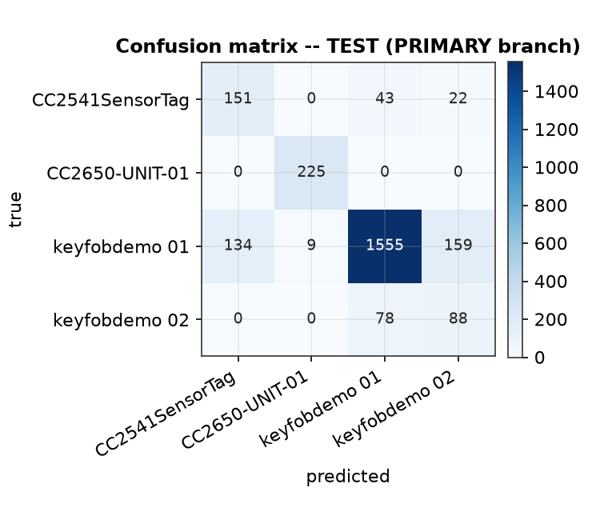
  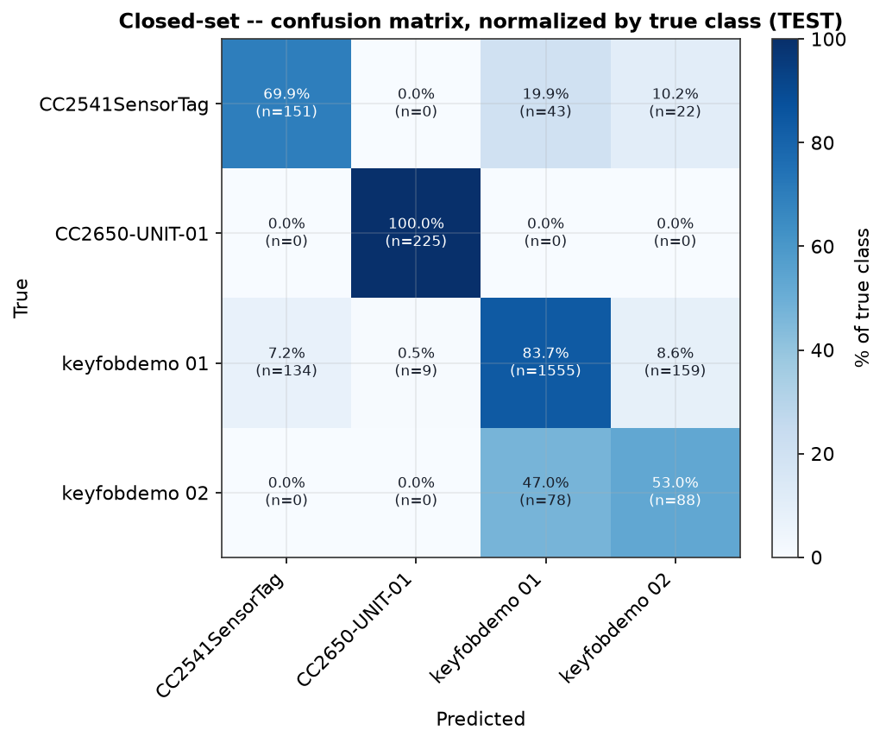

- **Per-unit TEST recall** (PRIMARY branch), reported individually because
  the aggregate balanced-accuracy number hides real per-source spread on
  this naturally imbalanced split:

  | Unit | Recall (TEST) |
  |---|---:|
  | CC2650-UNIT-01 | 1.000 |
  | keyfobdemo 01 | 0.837 |
  | CC2541SensorTag | 0.699 |
  | keyfobdemo 02 | 0.530 |

  

<details>
<summary>Risk-coverage, seed variability, class-exclusion sensitivity, computational cost, auxiliary detectors, campaign timeline, forensic lineage</summary>

- **Risk-coverage curve** (TEST, PRIMARY branch) — the selective-prediction
  curve (El-Yaniv & Wiener, 2010) the platform's abstention mechanism is
  built on:

  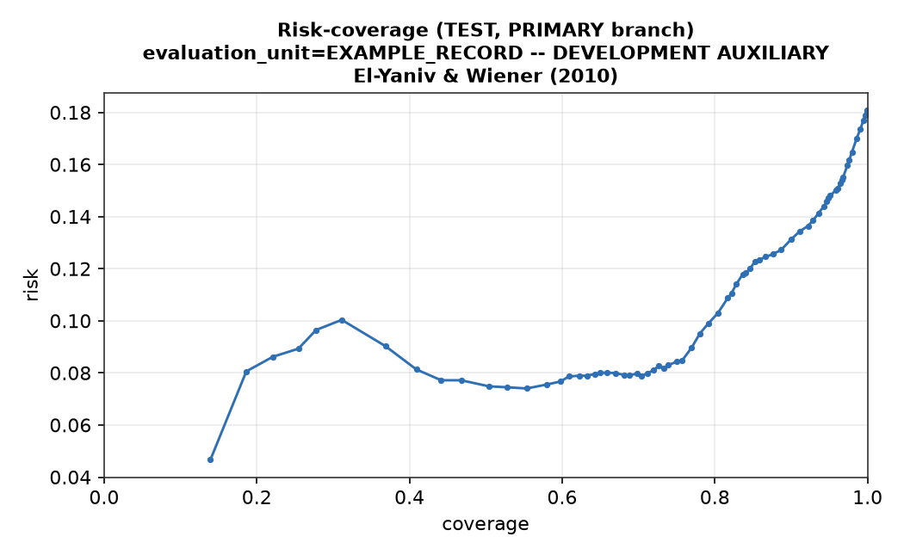

- **Seed variability** — PRIMARY re-trained under the platform's two other
  frozen seeds (`137`, `2024`, VALIDATION-only):

  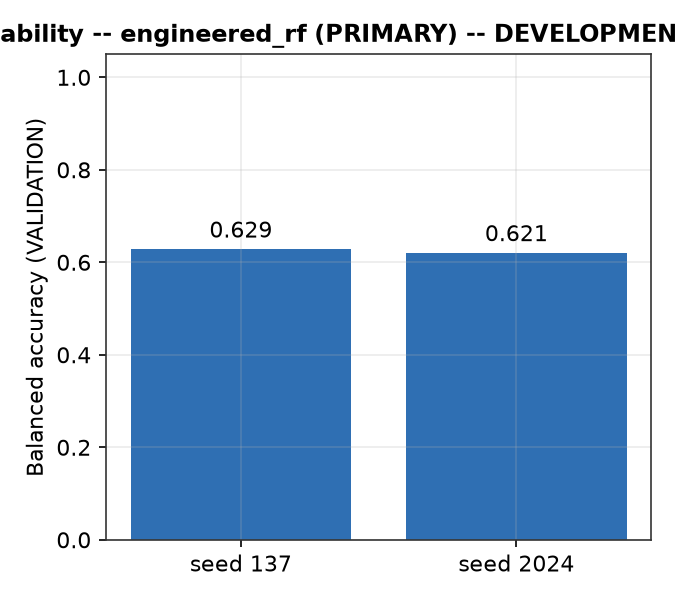

- **Enrolled-population class-exclusion sensitivity** — a post-hoc
  recomputation of aggregate VALIDATION BA from PRIMARY's own already-scored
  predictions, excluding one class's examples from the metric at a time (the
  model itself is **not retrained** — not leave-one-device-out
  cross-validation). Excluding `keyfobdemo 02` raises the remaining-class BA
  to 0.843 (`Δ=+0.209`); excluding any of the other three lowers it by
  0.049-0.106 — the aggregate score depends on the enrolled comparison
  population, not a population-independent measure of identifiability.
- **Computational cost** — real inference latency and serialized model size
  per RQ2 branch:

  

- **4 auxiliary per-unit TARGET_VS_BACKGROUND detectors** (not the closed-set
  result above): real per-unit `delta_dependence` ranges from −0.042 to
  +0.018, all substantially smaller than the closed-set effect (target-vs-
  background is an easier task with more redundant evidence per window):

  

- **Campaign timeline** — every study phase, colored by its real, current
  `execution_state`:

  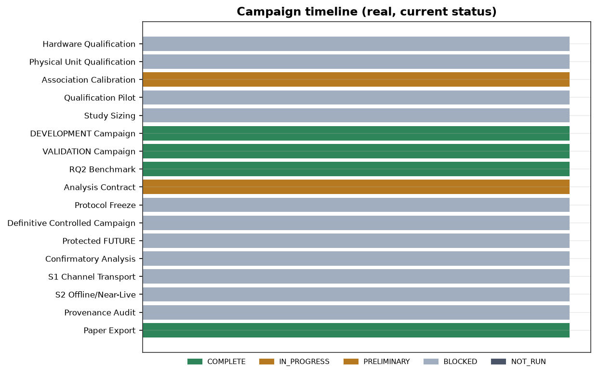

- **Forensic evidence lineage** — source I/Q -> burst -> PDU -> admitted
  example -> dataset -> split -> preprocessing -> model -> RQ1/RQ2 decision,
  with real IDs from the closed-set PRIMARY branch:

  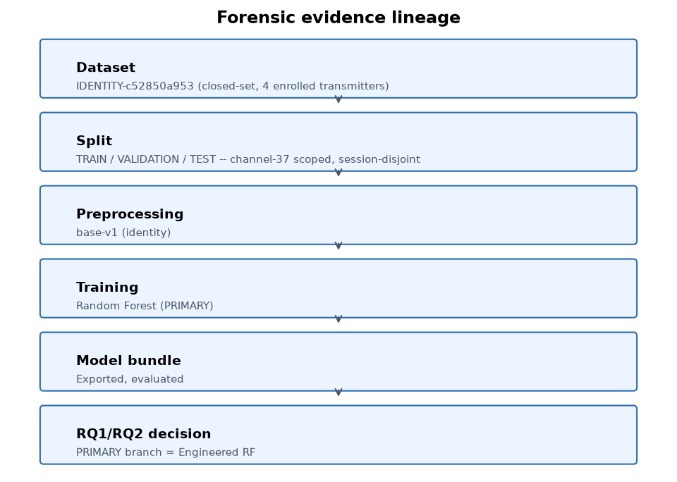

</details>

All figures above are generated straight from the platform's own real,
persisted evidence by
[`docs/ble/generate_evidence_figures.py`](docs/ble/generate_evidence_figures.py)
— never hand-drawn, never edited to change a number. Regenerate after any
new real result (`--verify` cross-checks every figure's source-artifact hash
without regenerating anything):

```powershell
cd backend
./.venv-validation/Scripts/python.exe ../docs/ble/generate_evidence_figures.py
```

Or from the platform itself: BLE Scientific Results Studio -> **Evidence
Dashboard** tab -> "Generar imagenes nuevas (README + notebook)". Either path
only writes files into the working tree — review the diff and
`git add`/`commit`/`push` yourself afterward. Same data, same plotting
functions, also available as a runnable notebook:
[`docs/ble/evidence_figures.ipynb`](docs/ble/evidence_figures.ipynb). Full
field-by-field sourcing, a canonical artifact inventory with SHA-256, and
two complete traceability chains (one VALIDATION prediction, one TEST
prediction, each traced back to a rehashed source I/Q file):
[`docs/ble/TECHNICAL_EVIDENCE_AUDIT.md`](docs/ble/TECHNICAL_EVIDENCE_AUDIT.md),
underlying small JSON artifacts published under
[`docs/ble/evidence/`](docs/ble/evidence/).

---

### Scientific limitations

- **Session/transmitter confounding.** No current receiver session contains
  more than one enrolled transmitter (verified: 79/79 sessions are
  single-unit). Each transmitter is represented across multiple sessions, so
  transmitter identity and session are not mathematically identical
  variables — but the design lacks within-session multi-transmitter
  observations that would let transmitter effects be directly separated from
  session-specific receiver, propagation, noise, or environmental state.
  Applies to every result in [Current experimental
  results](#current-experimental-results), including RQ1's
  acquisition-dependence contrast and the RQ4/feature-group-ablation
  controls.
- **No calibrated per-burst SNR.** The acquisition profile records receiver
  gain, sample rate, bandwidth, and center frequency, but no per-burst SNR
  or received-power estimate is computed or persisted; `mean_power_dbfs` is
  a raw amplitude statistic, not a calibrated SNR measurement.
- **Same-model internal equivalence.** See [keyfobdemo 01 vs keyfobdemo 02:
  same model, unverified
  equivalence](#keyfobdemo-01-vs-keyfobdemo-02-same-model-unverified-equivalence)
  — `keyfobdemo 01`/`02` are two distinct physical units of the same
  commercial model per the experimenter's own declaration; the exact
  commercial model identifier is not documented in any artifact, and
  hardware/firmware/chip-revision/configuration equivalence is neither
  documented nor independently verified.
- **Protocol freeze.** The frozen analytical-contract mechanism is real and
  versioned, but no protocol has been run through the confirmatory freeze
  ceremony that would make protected-future access eligible (see [Held-out
  TEST vs. the future confirmatory
  campaign](#held-out-test-vs-the-future-confirmatory-campaign) and [Pending
  experimental work](#pending-experimental-work)).
- **Development label admission ≠ independently corroborated source
  association.** See [Label provenance](#label-provenance) and [Native BLE
  and B200 association](#native-ble-and-b200-association) — 0 real examples
  currently have `STRONG` native-BLE/SDR association.
- **Native BLE / B200 association.** See [Native BLE and B200
  association](#native-ble-and-b200-association) for the complete, single
  authoritative treatment (timing sweep, ±250 ms candidate-search tolerance,
  0 STRONG, 28 AMBIGUOUS) — not repeated here.
- **RF acquisition profile, partial.** Receiver/SDR/channel/frequency/
  sample-rate/bandwidth/gain/duration are all real and fully sourced;
  antenna model, TX-RX distance/geometry, and environment/location have
  **no schema field at all** (structural, not a search failure).
- **BLE-RFFI live-spectrum inference.** See [Real-time spectrum and device
  visualization](#real-time-spectrum-and-device-visualization) for the
  complete treatment, including the one real documented discrimination
  failure — not repeated here.

Full detail behind each item, including the exact artifacts and computed
values: [`docs/ble/TECHNICAL_EVIDENCE_AUDIT.md`](docs/ble/TECHNICAL_EVIDENCE_AUDIT.md).

---

### Pending experimental work

| Item | Mechanism | Real evidence / status |
|---|---|---|
| Protected future confirmatory campaign | Real, versioned freeze mechanism | `NOT_YET_AVAILABLE` — gated behind a protocol freeze that has not started |
| RQ3 radio-state intervention | Implemented, sample size frozen (80 pairs: 10 RESET + 10 CONTROL per unit, 4 units) | `PENDING` — 0 real captures carry RQ3 metadata, 0 valid empirical pairs exist |
| RQ4 packet-condition intervention (original vs. controlled variant) | Implemented eligibility check | `NOT_AVAILABLE: CONTROLLED_VARIANT_NOT_AVAILABLE` — 0/4 enrolled units eligible; distinct from the already-executed analytical-region control in [RQ4 results](#rq4-results-analytical-region-control) |
| CH37 -> CH38 transport measurement | Real CH38 RF data exists (1,663 admitted examples for the four enrolled units, deliberately excluded from the RQ1/RQ2/RQ4 channel-37-only split) | `NOT_AVAILABLE` for the transport result itself — no `channel_transport_report.json` yet |
| CH39 | — | **0** real CH39 captures for the four enrolled units (exactly 1 CH39 capture exists anywhere in the store, for an unrelated diagnostic unit) |
| Persisted near-live BLE-RFFI prediction collection | Live-check mechanism real and wired (see [Real-time spectrum and device visualization](#real-time-spectrum-and-device-visualization)) | `NOT_AVAILABLE` — no collection mechanism wired yet |
| BLE-RFFI live path empirical characterization | Live-check mechanism real and wired (see [Status and evidence](#status-and-evidence)) | One real manual trial only; no latency/drop-rate/offline-agreement measurement |

A passing test suite is evidence the code does what its own tests assert —
it is never treated as scientific validation anywhere in this project.

---

### Scientific evidence and documentation

The scientific record is intentionally deeper than this README. Start with
these sources when reproducing, auditing, or writing from the BLE-RFFI
study:

- [`docs/ble/SCIENTIFIC_STATUS.md`](docs/ble/SCIENTIFIC_STATUS.md) -- current BLE scientific evidence, experiment state, and evidence-to-decision trace.
- [`docs/ble/TECHNICAL_EVIDENCE_AUDIT.md`](docs/ble/TECHNICAL_EVIDENCE_AUDIT.md) -- field-by-field sourcing and traceability for reported results.
- [`docs/ble/B200_ACQUISITION_CHAIN_TECHNICAL_AUDIT.md`](docs/ble/B200_ACQUISITION_CHAIN_TECHNICAL_AUDIT.md) -- BLE-RFFI SoapySDR/UHD acquisition chain.
- [`docs/ble/BLE_ADAPTER_TECHNICAL_AUDIT.md`](docs/ble/BLE_ADAPTER_TECHNICAL_AUDIT.md) -- bounded role of the conventional BLE adapter used alongside the B200.
- [`docs/ble/PREPROCESSING.md`](docs/ble/PREPROCESSING.md) -- preprocessing definitions and provenance.
- [`docs/research/CONTRIBUTION.md`](docs/research/CONTRIBUTION.md) -- scientific contribution and prior-art positioning.
- [`PENDING_TO_CLOSE.md`](PENDING_TO_CLOSE.md) -- remaining real acquisition, validation, and confirmatory gates.

For academic reporting, record the software revision, hardware
configuration, dataset version, acquisition conditions, and whether a
number comes from DEVELOPMENT, held-out same-campaign TEST, or a future
confirmatory evaluation.

---

<a id="part-ii-broader-platform"></a>
## Part II — Broader SpectraRFˣ platform capabilities

The rest of this README describes the **research environment around the
paper**. These capabilities let a scientist, RF engineer, or technical
operator inspect the spectrum from other perspectives, capture new
evidence, compare temporal behavior, examine three-dimensional morphology,
test demodulation hypotheses, and continue investigating signals without
being restricted to the BLE-RFFI contribution in Part I.

This broader layer is valuable precisely because it is not forced into the
paper's question. A researcher can use the same platform to ask different
RF questions, build new experiments, or visually inspect unexpected
activity while keeping the scientific boundary of the BLE-RFFI study
intact.

### What SpectraRFˣ is beyond the paper

SpectraRFˣ is a software-defined-radio research platform for RF
acquisition, spectrum analysis, controlled experimentation, evidence
traceability, signal visualization, and physical-layer source comparison.
It combines real SDR acquisition, spectrum/waterfall/3D visualization,
governed I/Q datasets, BLE-RFFI workflows, experimental controls,
demodulation, rule-based RF hypotheses, and traceable evaluation in one
environment.

The platform is not presented as a finished-product claim. Every module
should continue to state what is implemented, what real evidence supports
it, what is exploratory, and what remains unavailable.

### Engineering objectives beyond the paper

- acquire real RF with SDR hardware and retain complex I/Q;
- provide live spectrum, waterfall, hold/average tools, and three-dimensional spectral-terrain views;
- govern captured datasets, labels, quality, review state, and experimental splits;
- support RF-object morphology and cautious rule-based hypotheses without confusing energy detection with protocol decoding;
- expose analog and digital demodulation workflows for technical exploration;
- reuse scientific models where appropriate while keeping live/operational behavior distinct from paper validation;
- maintain traceability between measurements, derived artifacts, hypotheses, and retained evidence.

All platform screenshots and figures below are rendered as **individual
centered blocks**, each introduced and captioned so its role is clear
before the reader moves to the next capability.

### Platform modules at a glance

| Module | What it does | Current status |
|---|---|---|
| **Live Monitor** (`/spectrum`) | Real-time spectrum/waterfall workspace: connect, tune, gain, markers, visualization | Implemented — general SDR workspace |
| **RF Terrain 3D** (`/rf-terrain`) | Real-time 3D spectral terrain: adaptive noise floor, persistence, occupancy, terrain objects, plus offline reconstruction from a preserved I/Q capture | Implemented — general SDR workspace |
| **Capture Lab** (`/capture`) | Controlled acquisition of real complex I/Q, immediate or triggered-burst | Implemented — general SDR workspace |
| **Dataset Builder** (`/dataset-builder`) | Governance gate between acquisition and model use: QC, labels, splits | Implemented — general SDR workspace |
| **BLE-RFFI Studio** (`/ble-rffi-studio`) | The BLE-RFFI workflow itself: capture, evidence, dataset, split, training, decision windows | Implemented, real DEVELOPMENT evidence (see [Current experimental results](#current-experimental-results)) |
| **BLE Scientific Results Studio** (`/ble-scientific-results`) | Formal scientific record: RQ1–RQ4 evidence dashboard, supporting tables, completeness tracker | Implemented, real DEVELOPMENT evidence |
| **RF Intelligence** (`/rf-intelligence`) | Rule-based RF-object detection overlaid on the live spectrum | Implemented — not BLE-RFFI, not machine-learned (see [Real-time spectrum and device visualization](#real-time-spectrum-and-device-visualization)) |
| **Demodulation** / **Live Demodulation** | Marker-selected or live AM/FM/NFM/WFM/digital demodulation | Implemented — general SDR workspace |

Full descriptions and screenshots: [Platform modules and UI](#platform-modules-and-ui).

### Real-time spectrum and device visualization

This platform separates three capabilities that are easy to conflate. Full
technical audit with file/line citations, latency table, and one real
documented failure case:
[`docs/ble/REAL_TIME_SPECTRUM_DEVICE_VISUALIZATION_AUDIT.md`](docs/ble/REAL_TIME_SPECTRUM_DEVICE_VISUALIZATION_AUDIT.md).

```text
B200 live RF (general spectrum subsystem, GNU Radio/uhd_gnuradio)
     |
     v
spectrum / waterfall (100 ms poll)
     |
     +--> RF Intelligence: rule-based band-profile matching (not ML, not BLE-RFFI)
     |    -> labeled box overlay on the spectrum trace, 1200 ms poll
     |
     +--> BLE-RFFI live-spectrum inference: real trained RFFI bundle
          -> energy-threshold burst (default) or Gate-2A.2-decoded burst (opt-in)
          -> real frequency-positioned confidence band overlay on the same spectrum, ~1500 ms poll
```

#### RF Intelligence: rule-based hypothesis

Available at `/rf-intelligence`, and as a live overlay on Live Monitor —
real, working, rule-based: candidate energy regions scored against a static
band-profile catalog (frequency range + expected bandwidth + SNR). A
`"bluetooth_ble"` profile family exists, so it can flag "this looks like
it's in the BLE band" — that is a band-profile guess, **never** a decoded
packet and **never** an enrolled-device identification. Real screenshots
exist (see [Status and evidence](#status-and-evidence)) — both show
broadcast-FM detections, not BLE.

#### BLE-RFFI live-spectrum inference

`BleRffiLiveModelPanel`, embedded directly in the Live Monitor page —
genuinely more built than a first glance suggests. It reuses Live Monitor's
own already-open B200 stream (GNU-Radio path, not the SoapySDR
training-data path), runs a real exported model bundle
(`OfflineInferenceService.run_live()`) against a live-selected burst window,
and **does** draw a real, frequency-positioned colored band on the spectrum
canvas with a confidence percentage and device label — exactly the kind of
overlay a reader would picture from the description "device detected on the
spectrum." What keeps this from being a validated capability:

- By default the classified window is a raw energy-threshold burst, **not**
  the CRC-validated, bit-aligned window every TRAIN/VALIDATION/TEST example
  was built from — a documented mismatch. An opt-in flag
  (`BLE_LIVE_DECODE_ENABLED`, off unless explicitly enabled) closes that
  specific gap using a decoder that is itself not yet frozen (381/384 on its
  own development sweep).
- **One real, human-operated hardware trial exists** (2026-07-30, full table
  in [Status and evidence](#status-and-evidence)): with decode enabled and
  the target device's registered address correctly confirmed while it was
  genuinely transmitting, the classifier's confidence (0.97) was
  statistically indistinguishable from its confidence on a completely
  unrelated ambient BLE transmitter while the target device was OFF. Energy
  detection and address decoding tracked physical reality correctly; **the
  classifier did not discriminate the enrolled device**.
- No latency, throughput, or dropped-window measurement exists for this
  path; no automated test exercises it end to end; no result is persisted
  by default (each result does carry a real `timestamp_utc`, but nothing
  logs a running history of them).

#### What does not exist yet

A unified overlay merging RF Intelligence and BLE-RFFI live-spectrum
inference into one hypothesis; a persisted, timestamped collection of live
BLE-RFFI predictions; any automated test of the live chain.

#### Status and evidence

| Capability | Status |
|---|---|
| RF Intelligence rule-based overlay on live spectrum | **IMPLEMENTED** — real, screenshotted |
| BLE-RFFI live-spectrum inference, real bundle + real on-spectrum confidence band | **IMPLEMENTED_BUT_NOT_EMPIRICALLY_CHARACTERIZED** for reliability at scale — and not simply "uncharacterized": one real trial already shows the classifier fails to discriminate the enrolled device from ambient BLE traffic |
| Persisted log of near-live BLE-RFFI predictions | **NOT_IMPLEMENTED** |
| Automated end-to-end test of the live chain | **NOT_IMPLEMENTED** |
| "Validated real-time RF device identification" | **NOT_IMPLEMENTED / not claimable** — this repository already avoids "real-time" for this capability, using **"online experimental inference"** or **"live-spectrum inference"** instead, and the one real trial available is a documented negative discrimination result |

Real screenshots — both of RF Intelligence, neither of BLE-RFFI live
inference, since no screenshot of the BLE-RFFI live overlay exists in this
repository:

<p align="center">
  
</p>

<p align="center"><em>Live Monitor with RF Intelligence overlay.</em></p>

<p align="center">
  
</p>

<p align="center"><em>RF Intelligence.</em></p>

The one real evidence of the BLE-RFFI live-spectrum capability is a table of
real, timestamped device-state/decode/confidence values from a manual
on/off/on/off test, not a screenshot:
[`backend/app/modules/ble_rffi_studio/README.md`](backend/app/modules/ble_rffi_studio/README.md)
("Real, live on/off/on/off test"). Full audit, every file/line citation, the
complete latency table, and what would be needed for a scientifically solid
real-time claim:
[`docs/ble/REAL_TIME_SPECTRUM_DEVICE_VISUALIZATION_AUDIT.md`](docs/ble/REAL_TIME_SPECTRUM_DEVICE_VISUALIZATION_AUDIT.md).

**Evidence-timestamp convention, adopted from this point forward.** Any
screenshot, recording, or generated artifact added to this repository as
scientific or platform evidence should carry an explicit UTC capture
timestamp — in the filename (e.g. `evidence_live_monitor_20260825T120000Z.png`)
or as adjacent caption text — rather than relying on the git commit date
alone, since a file can be re-committed without the underlying content being
freshly recaptured. Figures generated by
[`docs/ble/generate_evidence_figures.py`](docs/ble/generate_evidence_figures.py)
already carry a `generated_at` field in `paper_exports/figure_manifest.json`
for exactly this reason; this convention extends the same discipline to
manually captured screenshots, which have no equivalent today.

---

### Platform modules and UI

BLE-RFFI Studio is the platform's primary research workflow. The same
backend also hosts the general SDR/RF workspace it is built on (see
[Experimental architecture](#experimental-architecture)).

#### Live Monitor -- `/spectrum`

Real-time RF workspace: SDR connection and stream controls, frequency,
span, sample-rate, gain, antenna, markers, visualization, the RF
Intelligence overlay, and the BLE-RFFI live-spectrum inference panel (see
[Real-time spectrum and device visualization](#real-time-spectrum-and-device-visualization)).

<p align="center">
  
</p>

<p align="center"><em>Live Monitor spectrum.</em></p>

<details>
<summary>Waterfall, RF Intelligence overlay, Spectrum Tools, legacy view</summary>

<p align="center">
  
</p>

<p align="center"><em>Live Monitor with waterfall.</em></p>

<p align="center">
  
</p>

<p align="center"><em>Live Monitor with RF Intelligence overlay.</em></p>

<p align="center">
  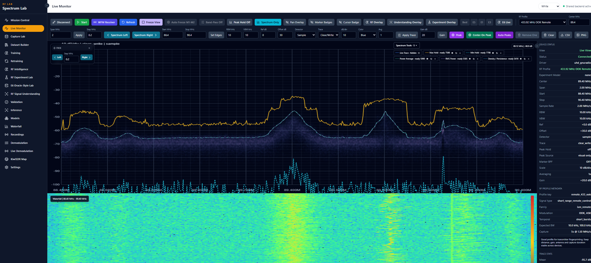
</p>

<p align="center"><em>Spectrum Tools.</em></p>

<p align="center">
  
</p>

<p align="center"><em>Animated Spectrum Tools demonstration.</em></p>

<p align="center">
  
</p>

<p align="center"><em>Legacy Live Monitor waterfall.</em></p>

Spectrum Tools definitions and validation checks:
[`frontend/src/features/spectrum-tools/VALIDATION.md`](frontend/src/features/spectrum-tools/VALIDATION.md).

</details>

#### RF Terrain 3D -- `/rf-terrain`

A real-time three-dimensional spectral terrain: frequency on one axis,
time on another, signal magnitude as height, the newest capture rendered
at the front and older activity receding into the distance as it ages.
The module is architecturally isolated from Live Monitor and the legacy
Waterfall — it reads the same live spectrum feed but runs its own
rendering and analysis path alongside them.

<p align="center">
  
</p>

<p align="center"><em>RF Terrain 3D -- live WFM spectrum moving through time and frequency.</em></p>

<p align="center">
  
</p>

<p align="center"><em>RF Terrain 3D -- BLE advertising channel.</em></p>

<p align="center">
  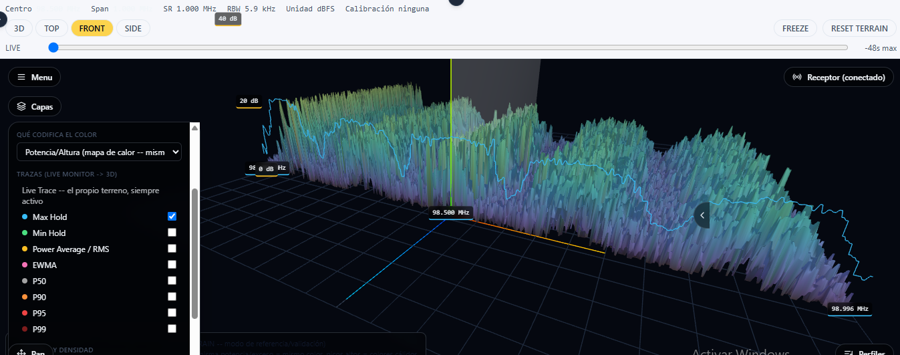
</p>

<p align="center"><em>RF Terrain 3D -- WFM broadcast carrier.</em></p>

Four height/color modes read the same live data differently: **RAW**
(height and color both track raw power, a direct 3D analogue of the
legacy waterfall, used to validate the pipeline against it), **ADAPTIVE**
(height is excess above a per-bin, adaptively-estimated noise floor —
never labeled "SNR" without a calibrated reference — color independently
selectable as a power/height heat-map, temporal persistence, or
occupancy), **OCCUPANCY** (same height, color driven by real-Δt-based
occupancy rather than raw frame counts), and **DENSITY** (the same
noise-referenced excess, smoothed across the frequency axis into one
continuous surface instead of many independent per-bin spikes — a
readability reconstruction, explicitly not a calibrated Power Spectral
Density; the inspector and reference ribbons keep showing the real,
unsmoothed per-bin value regardless of mode). What that combination makes
directly visible:

- **Adaptive local baseline instead of a fixed reference.** Every
  frequency bin gets its own rolling noise-floor estimate, so the terrain
  height reads as "how far above the local environment is this," not raw
  power against one global scale — a weak but locally significant emitter
  and a strong one in a noisier band can both stand out correctly.
- **Persistence as a dimension independent of height.** A brand-new,
  momentarily strong emission and a long-running one at the same peak
  height render at the same height but different color, because
  persistence is tracked as its own exponentially-decaying signal
  presence indicator, not derived from height.
- **Morphological terrain objects, tracked over time.** Dual-threshold
  ("hysteresis") connected-component segmentation over the thresholded
  excess surface extracts discrete regions with measured start/stop
  frequency, bandwidth, duration, peak/mean excess, and a ridge slope from
  a least-squares fit across the object's time-frequency footprint — a
  chirp, a hop, or a burst becomes a countable, measurable shape, not just
  a visual impression. Each object also gets a geometric classification
  (ridge, island, plateau, transient, drifting, or a re-triggering
  "hopping cluster") and a stable track ID that persists across
  segmentation passes for as long as the same emission keeps being
  re-detected — never a protocol/device label.
- **A coherent object surface, not a field of individual FFT bins.**
  Selecting a terrain object reconstructs a small, gold metallic surface
  from that object's own measured cells (smoothed only within the
  object's own real extent) so it reads as one mountain instead of a dense
  field of thin per-bin spikes — a visual reconstruction layered on top of
  the measurement, never a replacement for it: every number the inspector
  shows still comes from the same raw, unsmoothed grid.
- **Frequency-hopping and continuous carriers read differently at a
  glance**, which is exactly what the two example captures above show: a
  BLE advertising channel appears as a dense field of short, bursty
  peaks, while a WFM broadcast carrier appears as one broad, persistent
  ridge — the same underlying live-spectrum pipeline, two visibly
  different terrain shapes.
- **A bounded, real rewind window** (roughly 48 seconds, deliberately
  capped rather than an unbounded history buffer) lets an operator look
  back at recently-passed activity without paying an unbounded memory
  cost for it.
- **The terrain surface itself can be Max Hold, Min Hold, Average/RMS,
  EWMA, or any percentile (P50/P90/P95/P99)** — not just a thin reference
  ribbon drawn over the live mountain, the whole 3D surface can switch to
  show that statistic instead of the live signal, with an explicit choice
  of scope: only new rows going forward (the default), or a retroactive
  repaint of every row currently on screen from its own real cached value
  — never a fabricated history, only what was actually measured for that
  row.
- **A forensic click inspector (FSEI).** Clicking a terrain object marks it
  with a gold reticle and pins it for review while the terrain keeps
  flowing underneath; every value in the expanded dossier is tagged as
  `MEASURED`, `DERIVED`, `HYPOTHESIS`, `EVIDENCE`, or `SIMULATED`, and
  sections with no real backing data (I/Q-evidence linkage, an
  RF-Intelligence device/protocol hypothesis, a physical-source signature
  comparison) say so explicitly instead of guessing. Full detail: [RF
  Terrain 3D technical report](docs/rf_terrain/RF_TERRAIN_3D_TECHNICAL_REPORT.md#14-fsei--forensic-spectral-evidence-inspector).
- **A cockpit-style HUD chrome.** Every floating panel (Menu, Receiver,
  Pan, Profiles, the FSEI inspector, legend, status line) and the live
  frequency/time/power readout share one consistent dark cyan glass
  visual language — presentation only, isolated to this module's own
  components, no change to what any panel actually shows.
- **Offline Spectral Reconstruction from a preserved I/Q capture** (`Menu
  → Offline Reconstruction`, `SOURCE: OFFLINE`). LIVE and OFFLINE are two
  strictly separate, mutually-exclusive frame sources feeding the exact
  same rendering/analysis engine — never blended, and LIVE's own code path
  is untouched by this addition. Opening it auto-detects the most recent
  captures (up to 50, newest-first, never filtered by center frequency) via
  the platform's own real capture-listing endpoint, so picking one is a
  single click rather than requiring a memorized capture ID — a manual ID
  field remains for anything older than that. Once a capture is picked, it
  streams the real `cf32_le` I/Q file in bounded 16 MiB chunks — pipelined
  so the next chunk's network fetch overlaps the current chunk's
  processing — never loading a whole capture into memory, runs a
  from-scratch radix-2 FFT / Hann-windowed STFT over it, and replays the
  result through the same adaptive-baseline, persistence, occupancy and
  hysteresis-segmentation pipeline LIVE uses — so a reconstruction is
  deterministic (byte-identical rows for the same capture no matter how it
  was chunked) and explicitly bounded to the **observed spectral window**
  the receiver actually captured, never presented as full 2.4 GHz
  coverage. A dedicated, transparent **Reconstruction Monitor** window
  tracks the whole run precisely — current stage, elapsed time to
  millisecond precision, bytes/chunk/row counters, throughput, and ETA,
  all real measurements or direct arithmetic on them, never a cosmetic
  progress animation. Playback (Play/Pause/Step/Restart, a
  timeline scrubber, 0.5x-8x speed) only replays already-computed rows —
  speed never changes a single value. A **Spectral Context Audit** reports
  three real, already-computed aggregates about the *acquisition itself*
  (C1 local baseline distribution, C2 mean occupancy, C4 object density
  per second/MHz) and is wired so it can never reach the BLE-RFFI
  classifier. This is deliberately **not** a general-purpose RF file
  player and is not presented as a scientific contribution on its own —
  the only thing it adds is a deterministic, evidence-linked way to
  re-examine the spectral context around a preserved BLE-RFFI example.

What it adds to the platform as a whole: it gives Live Monitor's existing
Spectrum Tools (Max Hold, Min Hold, Power Average, EWMA, percentiles) a
second, simultaneous reading as 3D reference ribbons instead of only 2D
overlays; it reuses the same receiver controller and the same
frequency-profile presets Live Monitor already uses, so retuning from
either view stays consistent; and it gives an operator an independent
visual cross-check of the same live acquisition already exposed by Live
Monitor and the legacy Waterfall — useful for spotting hopping, chirps,
or wideband bursts that are easy to miss in a 2D trace. Like the RF
Intelligence overlay, RF Terrain Objects are morphological only: a shape
in the terrain is never presented as a decoded protocol or an identified
device.

**Implemented:** RAW/Adaptive/Occupancy rendering; adaptive-baseline,
persistence, occupancy, hold and average calculations; hysteresis
terrain-object segmentation with stable cross-pass tracking and geometric
classification; a reconstructed object-envelope surface for the selected
object; a click-to-select, pin-and-review forensic inspector (FSEI) with
epistemic-status tagging; freeze/reset; and Offline Spectral
Reconstruction from a preserved I/Q capture (chunked read, from-scratch
FFT/STFT, deterministic replay through the same engine, a Spectral
Context Audit, and exact sample-range FSEI evidence linkage for
OFFLINE-sourced selections). Every inspector value comes from the same
unsmoothed analytical model used for the objects and metrics, never from
the visual envelope or interpolated render geometry. An unmeasured row
(e.g. right after a reset/retune) renders as neutral fog matching the
scene's own background, never as a duplicate of a real measurement.
**Not yet implemented:** multiresolution long-history compression; an
exact per-cell object shape shipped to the frontend (click hit-testing and
the object envelope both use documented, honest approximations instead);
for **LIVE** selections specifically, I/Q-evidence linkage, an
RF-Intelligence hypothesis, and a physical-source comparison remain
unavailable and FSEI says so explicitly (LIVE has no preserved capture to
link back to; only an OFFLINE reconstruction does); within Offline
Reconstruction itself, nearby-spectral-activity context (C3) and part of
temporal-variability context (C5), report/export with provenance, a BLE
evidence overlay, and running the analysis engine off the main thread are
documented gaps, not silent omissions. The legacy Waterfall (`/waterfall`)
remains available as a fallback view.

#### Capture Lab -- `/capture`

Controlled acquisition of real complex I/Q: immediate capture, or triggered
burst capture with a bounded pre-trigger buffer. Every capture preserves
raw I/Q, acquisition configuration, timing, labels/split, quality metadata,
and a SHA-256 checksum.

<p align="center">
  
</p>

<p align="center"><em>Capture Lab.</em></p>

<details>
<summary>Earlier Capture Lab signal-analysis interface</summary>

<p align="center">
  
</p>

<p align="center"><em>Capture Lab signal analysis.</em></p>

</details>

#### Dataset Builder -- `/dataset-builder`

The governance gate between acquisition and model use: offline QC, label
and review-state management, experimental split control, and
duplicate/overlap safeguards before anything can enter training or
validation.

<p align="center">
  
</p>

<p align="center"><em>Dataset Builder.</em></p>

#### BLE-RFFI Studio -- `/ble-rffi-studio`

The workflow this document is built around — capture, evidence, dataset,
split, training, decision windows, and live-spectrum inference (see
[Real-time spectrum and device
visualization](#real-time-spectrum-and-device-visualization)), over real
USRP B200 acquisitions. No dedicated UI screenshot is included in this
README yet; the module's own scope, findings, and real evidence are
documented in
[`backend/app/modules/ble_rffi_studio/README.md`](backend/app/modules/ble_rffi_studio/README.md)
and [`docs/ble/SCIENTIFIC_STATUS.md`](docs/ble/SCIENTIFIC_STATUS.md).

#### BLE Scientific Results Studio -- `/ble-scientific-results`

Turns BLE-RFFI Studio's captures into the formal scientific record behind
[Scientific controls](#scientific-controls-rq1-to-rq4) and [current
experimental results](#current-experimental-results): strict association
semantics (see [Native BLE and B200
association](#native-ble-and-b200-association)), an eligibility/diagnostics
split, protocol-deviation classification, and real time-based decision
windows. Its **Guided Validation** tab is a real, wired capture-first wizard
for non-experts (Live Timing Diagnostic, Reinforced Target-Absence Control)
— real runs so far are consistent with the 0 STRONG associations stated in
[Native BLE and B200 association](#native-ble-and-b200-association). Its
**Evidence Dashboard** tab is a live, refreshable, in-platform view of
[current results](#current-experimental-results), RQ3's sample-size
decision and campaign progress, and RQ4's per-unit eligibility — reads the
same persisted artifacts live, never a snapshot, with bootstrap CI error
bars, a raw/normalized confusion-matrix toggle, real decision-window/capture
counts per domain, and a `CURRENT TEST EVIDENCE` label on risk-coverage (the
confirmatory variant stays pending until the future confirmatory campaign
runs, see [Pending experimental work](#pending-experimental-work)). Its
**Supporting Tables** tab adds per-transmitter capture composition,
per-partition windows/captures/sessions for any real split, label
provenance, and receiver-epoch composition. Its **Scientific Completeness**
tab renders one real, live status per paper element (`AVAILABLE` /
`PENDING_REAL_ACQUISITION` / `BLOCKED` / `NOT_ELIGIBLE` / `PROTECTED`, with
the real missing evidence) — the in-platform mirror of
[`PENDING_TO_CLOSE.md`](PENDING_TO_CLOSE.md). No dedicated UI screenshot
yet; detail: [`docs/ble/SCIENTIFIC_STATUS.md`](docs/ble/SCIENTIFIC_STATUS.md).

#### RF Intelligence -- `/rf-intelligence`

Rule/profile-based RF-object detection and cautious protocol hypotheses
(see [RF Intelligence: rule-based
hypothesis](#rf-intelligence-rule-based-hypothesis)). Energy in a frequency
region is never treated as proof that a protocol has been decoded.

<p align="center">
  
</p>

<p align="center"><em>RF Intelligence.</em></p>

#### Demodulation -- `/demodulation` and Live Demodulation -- `/live-demodulation`

Marker-selected or stored-acquisition demodulation (analog, digital, BLE,
IEEE 802.15.4, OOK/FSK, and experimental protocol pipelines), plus
continuous AM/FM/NFM/WFM audio recovery from the live stream. A signal is
never reported as successfully decoded merely because RF energy was
observed.

<p align="center">
  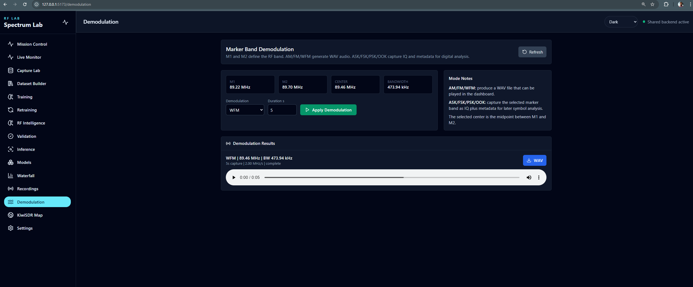
</p>

<p align="center"><em>Demodulation.</em></p>

<details>
<summary>Live Demodulation</summary>

<p align="center">
  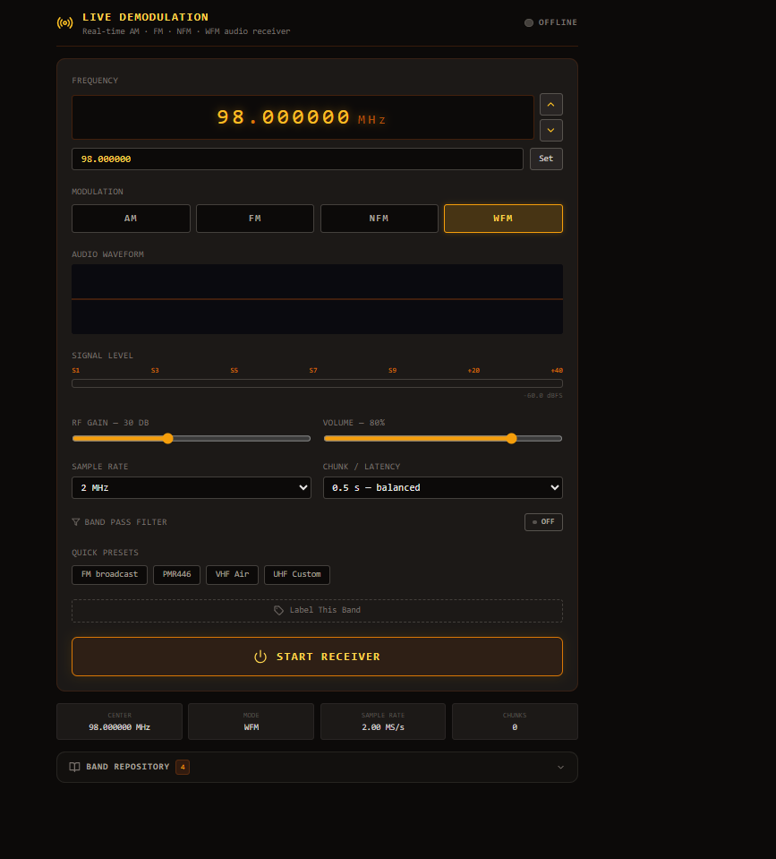
</p>

<p align="center"><em>Live Demodulation.</em></p>

</details>

#### Other views

Mission Control (`/`, operational dashboard), Spectrum Tools, RF Experiment
Lab (`/rf-experiment-lab`, the general-technique registry — E0/E1/E3/E5
implemented, see
[`docs/research/TECHNIQUE_ROADMAP.md`](docs/research/TECHNIQUE_ROADMAP.md)
for what is not), E6 Oracle-Style Lab (`/e6-oracle-style-lab`, a separate,
non-BLE classical-ML lab), RF Signal Understanding, Training/Retraining/
Validation/Inference/Models, Recordings, KiwiSDR Map, and Settings are all
real, working views of the same backend — module-by-module detail:
[`backend/README.md`](backend/README.md). The legacy Waterfall
(`/waterfall`) is still fully operational but no longer the default
spectrum-history view in navigation — see RF Terrain 3D, above.

---

## Quick start

```powershell
git clone https://github.com/Younyat/SpectraRFX.git
```

```powershell
uhd_find_devices
uhd_usrp_probe
```

Then, from the repository root:

```powershell
powershell -ExecutionPolicy Bypass -File .\start_unified.ps1
```

Core operator path once both processes are running:

```text
Live Monitor -> Capture Lab -> BLE-RFFI Studio -> Dataset Builder -> Training / Evaluation -> Experimental inference
```

Manual setup and every environment variable: [Backend setup](backend/README_SETUP.md).

## Reproducibility and technical documentation

```text
SpectraRFX
|
+-- frontend/    React / TypeScript / Vite -- operator views, spectrum visualization
+-- backend/     FastAPI -- SDR control, acquisition, dataset governance,
|                demodulation, RF fingerprinting, BLE-RFFI Studio, ML workflows
+-- backend/tools/  Two separate acquisition/DSP toolsets, kept explicit (see
|                    Experimental architecture): GNU Radio/UHD workers
|                    (general spectrum path) and SoapySDR/UHD workers
|                    (BLE-RFFI capture path: ble_sdr_capture_worker.py)
+-- docs/        scientific and technical documentation
+-- readme_img/  README figures
+-- start_unified.ps1
```

The **backend owns hardware-facing and scientific processing state**; the
frontend provides the operator workflow and visualization layer.

Every BLE-RFFI prediction traces back to its original I/Q (see the [full
evidence-lineage table](#full-evidence-lineage-table)). Metadata migrations
(corrections to already-persisted records — never to I/Q itself) are
recorded in an append-only migration ledger (`migration_id`, timestamps,
old/new value, reason, tool). Entries reconstructed after the fact are
explicitly flagged `RETROACTIVE_RECONSTRUCTION`. Full mechanism and real
counts (migration-ledger section):
[`docs/ble/SCIENTIFIC_STATUS.md`](docs/ble/SCIENTIFIC_STATUS.md).

### Documentation index

- [`PENDING_TO_CLOSE.md`](PENDING_TO_CLOSE.md) -- research status and
  pending validation: the confirmatory readiness gate, the RQ3 physical
  campaign, and the future confirmatory evaluation. Start here for "what's
  left."
- [`docs/ble/SCIENTIFIC_STATUS.md`](docs/ble/SCIENTIFIC_STATUS.md) --
  current BLE scientific evidence, full capability status, and the complete
  evidence-to-decision trace (start here for technical depth).
- [`docs/ble/TECHNICAL_EVIDENCE_AUDIT.md`](docs/ble/TECHNICAL_EVIDENCE_AUDIT.md)
  -- field-by-field sourcing and traceability chains for every number in
  [Current experimental results](#current-experimental-results).
- [`docs/ble/B200_ACQUISITION_CHAIN_TECHNICAL_AUDIT.md`](docs/ble/B200_ACQUISITION_CHAIN_TECHNICAL_AUDIT.md)
  -- the real BLE-RFFI SoapySDR/UHD acquisition chain, per layer.
- [`docs/ble/BLE_ADAPTER_TECHNICAL_AUDIT.md`](docs/ble/BLE_ADAPTER_TECHNICAL_AUDIT.md)
  -- the conventional BLE adapter used alongside the B200.
- [`docs/ble/REAL_TIME_SPECTRUM_DEVICE_VISUALIZATION_AUDIT.md`](docs/ble/REAL_TIME_SPECTRUM_DEVICE_VISUALIZATION_AUDIT.md)
  -- full technical audit behind [Real-time spectrum and device
  visualization](#real-time-spectrum-and-device-visualization).
- [`docs/rf_terrain/RF_TERRAIN_3D_TECHNICAL_REPORT.md`](docs/rf_terrain/RF_TERRAIN_3D_TECHNICAL_REPORT.md)
  -- full technical report behind RF Terrain 3D: every formula, metric, and
  design decision in the adaptive-baseline/persistence/occupancy/
  terrain-object pipeline.
- [`docs/ble/PREPROCESSING.md`](docs/ble/PREPROCESSING.md) -- the paper's
  Eq.(6)-(7) preprocessing, full derivation and per-burst provenance.
- [`docs/research/TECHNIQUE_ROADMAP.md`](docs/research/TECHNIQUE_ROADMAP.md)
  -- not-yet-implemented technique ideas, kept out of the executable
  benchmark.
- [`docs/research/CONTRIBUTION.md`](docs/research/CONTRIBUTION.md) --
  scientific contribution and prior-art positioning.
- [`backend/app/modules/ble_rffi_studio/README.md`](backend/app/modules/ble_rffi_studio/README.md)
  -- BLE-RFFI Studio module documentation: engineering obstacles, real
  findings, and implementation detail.
- [`docs/ble/PILOT_V1_LEGACY.md`](docs/ble/PILOT_V1_LEGACY.md) -- the
  superseded BLE Dataset Studio Pilot v1 baseline.
- [Backend documentation](backend/README.md) / [Backend setup](backend/README_SETUP.md)
  -- architecture, APIs, workers, hardware integration.
- [Frontend documentation](frontend/README.md)

### Citation

For academic use or publication, record the software revision, hardware
configuration, dataset version, acquisition conditions, and the relevant
validation state ([TEST vs. future confirmatory
campaign](#held-out-test-vs-the-future-confirmatory-campaign)) alongside any
reported result. A root-level `CITATION.cff` and explicit software license
are recommended for a citable release.

---

## Testing

```powershell
cd backend
python -m pytest app/tests/unit -q
```

```powershell
cd frontend
npm run build
```

Hardware-facing changes should additionally be tested against the actual
SDR path (device discovery, connect/stream, acquisition controls, capture,
dataset routing) — a passing unit-test suite alone is not evidence that a
hardware-dependent workflow has been validated over real RF input. As
[Status and evidence](#status-and-evidence) and [Pending experimental
work](#pending-experimental-work) record explicitly, the BLE-RFFI
live-spectrum inference chain in particular has **no automated test
coverage today** — its only real validation is the one manual hardware
trial cited in [Real-time spectrum and device
visualization](#real-time-spectrum-and-device-visualization).
